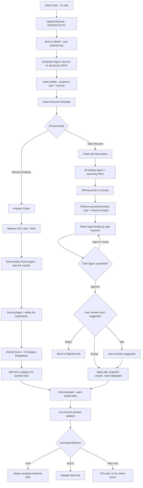
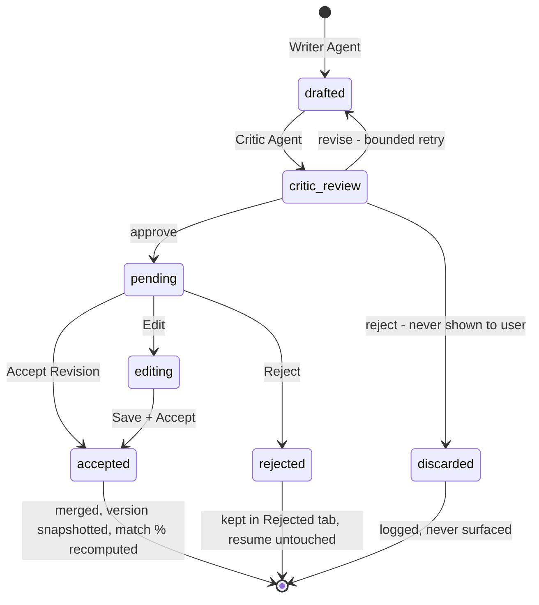
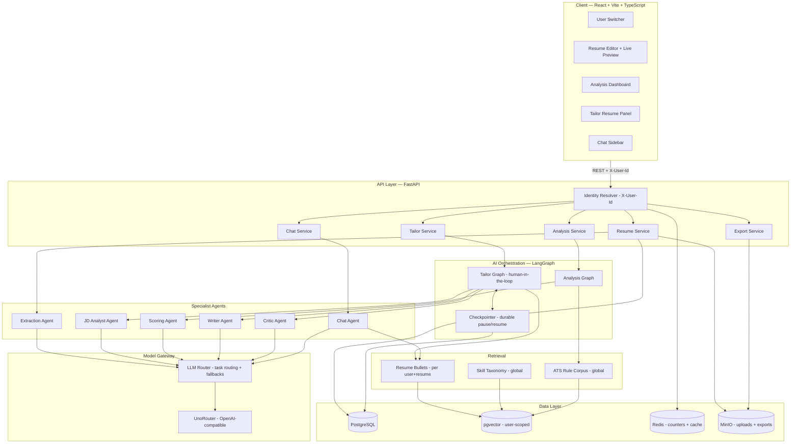
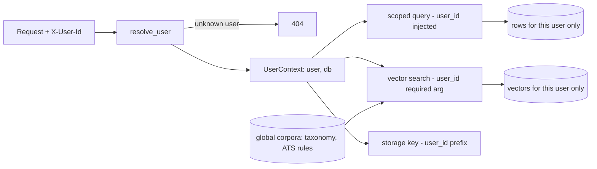
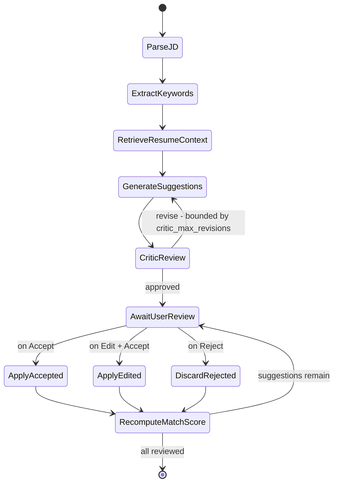
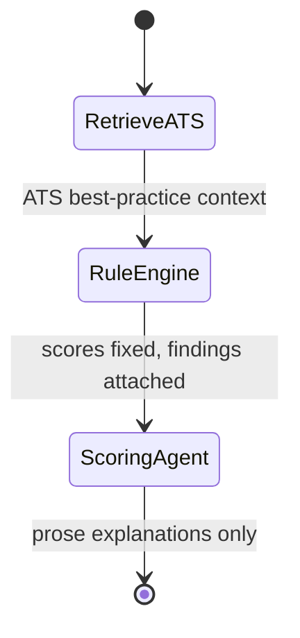
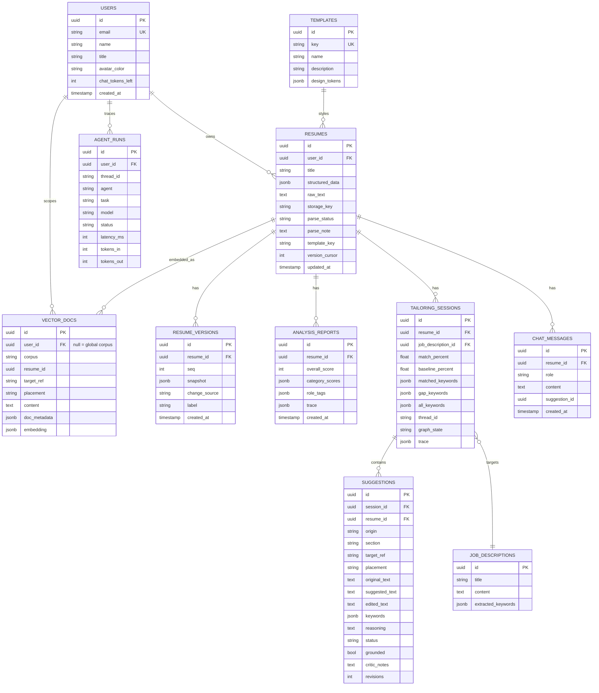
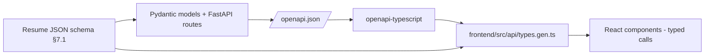
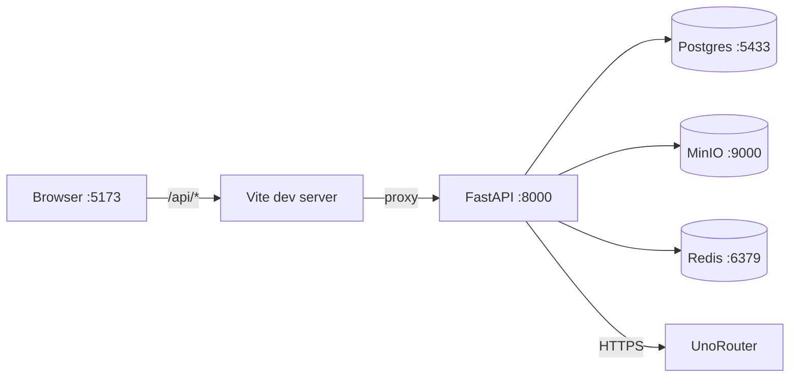

# ResumeAI — Product Design Document
### AI Resume Analysis & Tailoring Platform

**Status:** Design · **Owner:** Product/Eng

---

## 1. Executive Summary

ResumeAI is a web app where a job seeker uploads a resume, picks a visual template, and then uses two AI-powered modes to improve it:

- **Resume Analysis** — an ATS-style score (0–100) with a category-by-category breakdown and specific fixes.
- **Tailor Resume** — paste a job description and the app rewrites resume bullets to close keyword gaps, with every AI change surfaced as an **Accept / Reject / Edit** card so the user stays in control.

A persistent AI chat sits alongside the editor for open-ended help, and the resume renders live so changes are visible immediately.

### Operating parameters

| Parameter | Decision |
|---|---|
| Deployment | Runs locally via `docker compose`; single node |
| Authentication | **None.** Active user resolved from an `X-User-Id` header |
| Users | 5 seeded local users, chosen from a UI switcher |
| Scoping | Per-user — one user's resume content never grounds another user's suggestions |
| Model gateway | UnoRouter (`https://api.unorouter.com/v1`), OpenAI-compatible |
| Primary model | `gemini-3.5-flash-lite:free` (1M context) |
| Orchestration | LangGraph multi-agent graphs with human-in-the-loop interrupts |
| Retrieval | RAG over pgvector — three corpora |
| Object storage | MinIO (S3 API) |
| Input / output | PDF, DOCX, TXT in · PDF, DOCX, TXT out |
| Language | English resumes first |

---

## 2. Goals & Non-Goals

**Goals**
- Parse an uploaded resume into structured, editable data with high fidelity.
- Score resumes against ATS/recruiter heuristics and explain *why*, not just *what*.
- Tailor a resume to a job description while keeping every claim truthful — grounded in the user's actual content, no fabricated experience.
- Keep the human in the loop: every AI edit is reviewable before it touches the document.
- Route across multiple models so the product isn't single-vendor dependent and can fail over or route by cost.
- Keep the five local users independent — enforced structurally, not by convention.
- Make agent behaviour auditable without an external tracing SaaS.

**Non-goals**
- Job board integration / application tracking.
- Cover letter generation (a fast-follow on the same pipeline).
- Multi-language resumes.
- Multi-tenancy. One workspace, five users. §6.2 records what re-adding tenancy would cost.
- Authentication, authorization, billing. Scoping here is **data hygiene, not a security boundary** — see §12.
- Horizontal scale. Single-node by design.

---

## 3. User Flow



---

## 4. Screen-by-Screen UX Spec

### 4.1 User Switcher (top bar)
One dropdown, five seeded users. Switching re-scopes every panel — resume list, analysis, tailoring sessions, chat history. The active user is sent as `X-User-Id` on every request. This replaces a login screen.

### 4.2 Import Resume (modal)
- Fields: Resume Name, drag-and-drop upload (PDF/DOCX/TXT), live preview pane.
- On upload: validate type and size → store in MinIO under `{user_id}/{resume_id}/{filename}` → trigger async parse → spinner → editor once parsed.
- Parsing reads the file back *out of object storage*, so the pipeline is identical whether storage is MinIO or real S3.

### 4.3 Template Selection (modal)
- Grid of templates, each rendered with the user's *actual* parsed content once parsing completes, so the choice is realistic.
- Non-destructive: content is decoupled from layout, so switching never loses data.

### 4.4 Main Workspace (3-pane)
- **Left** — tabs: "Resume Analysis" / "Tailor Resume".
- **Center** — AI chat with quick-action chips, message history, token counter.
- **Right** — live rendered resume, zoom, undo/redo, "Templates & Settings", **Download**.

### 4.5 Resume Analysis tab
- Score ring (0–100) plus role/level tags, e.g. "software engineering", "junior · 2 yrs".
- Four category cards with improvement-count badges, expanding on click.
- Findings carry a `target_ref`, so clicking one highlights the offending bullet in the live preview — possible because deterministic rules know which bullet they inspected (§6.6).

### 4.6 Tailor Resume tab
- Keyword match % + "X of Y keywords integrated" + segmented progress bar.
- Tabs: **Active** (pending) / **Already Matched** (keywords the resume already had) / **Rejected**.
- Each card: keywords modified, placement (company/role), Original Bullet, Modified Bullet with the keyword highlighted, Reasoning, and **Reject / Accept Revision / Edit**.
- Cards show a **grounding badge** from the critic. Revised suggestions display the critic's note. Suggestions the critic rejected never render.

### 4.7 Download Resume
- **PDF** — default, template-styled; what most users submit.
- **DOCX** — editable Word file for manual tweaks or employers who request it.
- **TXT** — stripped of formatting, for ATS portals with "paste your resume" boxes.
- All three generated on demand from the same structured JSON (§7) — one source of truth, three renderers.
- Cached in the MinIO exports bucket keyed by **resume version**, so re-downloading an unchanged resume is a bucket read. Returns a presigned URL.

---

## 5. AI Suggestion Lifecycle

Every AI-proposed change — from Tailor Resume *or* chat — is a **Suggestion**, never applied directly:

```json
{
  "id": "sugg_8f2a",
  "session_id": "tailor_sess_01",
  "origin": "tailor",
  "section": "experience.bullet",
  "target_ref": "exp_2.bullet_1",
  "original_text": "Scaled the LiDAR processing platform to 6 distinct workloads...",
  "suggested_text": "Scaled the LiDAR processing platform to 6 distinct microservices... implementing rigorous unit and integration testing...",
  "edited_text": null,
  "keywords": ["Unit Testing", "Integration Testing"],
  "reasoning": "Reinforces fault-isolation claim through disciplined QA, a key requirement for the target role.",
  "status": "pending",
  "grounded": true,
  "critic_notes": "Reframes existing testing work; introduces no new claims.",
  "revisions": 0
}
```

`origin` is `tailor` or `chat` — the chat assistant emits the same object type, which is what gives chat edits the same review control. `grounded` / `critic_notes` / `revisions` carry the critic's audit trail.



Rules:
- `accepted` → resume JSON patched at `target_ref`, a new `resume_version` snapshot saved (every accept is undoable), match % recalculated.
- `rejected` → retained for the Rejected tab and audit trail, never applied.
- `edited` → user free-edits `suggested_text`; saving moves it to `accepted` with `edited_text` populated, and that is what merges.
- `discarded` → the critic judged it ungrounded. Logged for debugging, never rendered. The Active tab only ever contains suggestions that passed the grounding gate.
- Nothing is ever silently auto-applied. This is the core trust mechanism of the product.

---

## 6. System Architecture



### 6.1 Why this shape
- **Structured data is the source of truth**, not the rendered PDF. Parsing converts unstructured text into JSON once; templates render over that JSON, so switching templates or applying AI edits never means re-parsing.
- **AI orchestration is a separate layer** from API/CRUD, so prompts, retrieval and model routing evolve independently of the product API.
- **Everything AI produces flows through the Suggestion object** before touching the resume. This is what makes Accept/Reject/Edit possible everywhere, including chat.
- **Scoping is enforced at the lowest layer.** `user_id` is a required positional argument on every vector-search call and appears in the SQL `WHERE`. A developer who forgets it gets a `TypeError`, not a silent leak.
- **Agents are specialists, not one prompt.** One job, one prompt, one output schema, one model tier each.

### 6.2 Scoping model

Isolation is **user → resume**, enforced at four layers:

| Layer | Mechanism |
|---|---|
| **Schema** | `user_id` on every owned table, indexed, FK with `ON DELETE CASCADE` |
| **Query** | All reads go through `scoped(Model, user_id)`; single rows through `get_or_404(...)` |
| **Vector** | `user_id` is a **required argument** on `search()` and `index_documents()`, inside the SQL `WHERE` — not a post-filter |
| **Storage** | MinIO keys are `{user_id}/{resume_id}/{filename}`, so a bucket policy can enforce isolation at the storage layer too |

**Cross-user access returns 404, never 403.** A 403 confirms the resource exists; a 404 leaks nothing.

**Why scope at all with five users?** The alternative — one shared pool — means user A's bullets can be retrieved as grounding for user B's suggestions, producing rewrites that reference work the person never did. That is exactly the failure the critic agent exists to prevent. The cost of preventing it is one column and one `WHERE` clause.

**What is deliberately *not* scoped:** the skill taxonomy and ATS rule corpora are **global**. They are reference material containing no user data, so per-user copies would waste storage and embedding calls for no benefit.



**If multi-tenancy is needed later:** add a `tenants` table, add `tenant_id` beside `user_id` on the owned tables, extend the scoping helper from two arguments to three, and add `tenant_id` to the `vec_store` index and predicate. The single scoping choke point — rather than filters scattered across call sites — is what keeps this a mechanical change of roughly 80 lines.

### 6.3 The agent roster

| Agent | Input | Output | Model tier | Retrieval |
|---|---|---|---|---|
| **Extraction** | Raw resume text | `ParsedResume` + `needs_review[]` + confidence | cheap | — |
| **JD Analyst** | Job description | `JDAnalysis` — title, seniority, 12–20 keywords | cheap | Skill taxonomy (global) |
| **Scoring** | Resume + rule findings | `AnalysisResult` — *prose only* | strong | ATS rules (global) |
| **Writer** | Gap keywords + retrieved bullets | `DraftBatch` of suggestions | strong | Resume bullets (user-scoped) |
| **Critic** | One draft + its original | `CriticVerdict` — approve/revise/reject | strong | — |
| **Chat** | Message + history + resume | `ChatDecision` — reply ± proposed edit | mid | Resume bullets (user-scoped) |

**Why a separate critic agent.** The writer is instructed not to fabricate, but instruction-following is probabilistic and the failure mode is severe: a plausible invented credential that a candidate submits to a real employer. A second agent that only judges truthfulness — with no incentive to produce output — catches what the first missed. This is the single most important agent for product trust.

**The critic is backed by a deterministic check that cannot be talked out of.** Before the LLM critic runs, the orchestrator verifies the draft's `target_ref` resolves to a real bullet **in this user's resume**, and that `original_text` matches it verbatim. A draft citing a nonexistent bullet is dropped outright. The LLM critic then judges semantics; the code check guarantees provenance. Anti-hallucination is not left to a prompt.

### 6.4 Model gateway

One OpenAI-compatible endpoint fronting 200+ models, which preserves multi-provider redundancy without three SDK integrations.

- **Base URL** `https://api.unorouter.com/v1` · **Primary** `gemini-3.5-flash-lite:free`
- **Provider abstraction:** every agent calls `get_llm(task)`; the chat-model class is instantiated in exactly one file. Note the SDK takes `base_url` / `api_key` as field aliases.
- **Fallback chain:** `with_fallbacks()` — `gemini-3.5-flash-lite:free` → `gemini-3.1-flash-lite` → `gpt-oss-120b:free`, on error, timeout or rate-limit.
- **Cost/quality routing:** per-task config (`model_extract`, `model_rewrite`, `model_critic`, …), each defaulting to `model_default`. Upgrading bullet rewriting is one `.env` line.
- **Key handling:** `UNOROUTER_API_KEY` from `.env` — never committed, never in the database. A real secrets manager is deferred (§12).
- **Usage limits:** per-user `chat_tokens_left`, decremented per call, surfaced as the "Chat tokens left" counter. Exhaustion returns HTTP 429.
- **Graceful degradation:** with no API key the system still runs. A regex resume parser, deterministic keyword extraction and the rule-based scoring engine all work offline; only prose explanations and bullet rewriting go quiet.

### 6.5 Retrieval

| Corpus | Contents | Consumed by | Scope |
|---|---|---|---|
| `resume_bullets` | One doc per bullet/summary, tagged with `target_ref` and placement | Writer, Chat | **user + resume** |
| `skill_taxonomy` | ~200 alias→canonical pairs (`k8s` → `Kubernetes`) | JD Analyst | global |
| `ats_rules` | ATS best-practice rules in prose | Scoring | global |
| `exemplars` *(later)* | Anonymized high-scoring resumes | Writer | global, consent-gated |

**Storage:** pgvector with an `ivfflat` cosine index; `user_id` in both the index and the query predicate for `resume_bullets`. On SQLite the same interface falls back to numpy cosine — same results, no ANN index.

**Embeddings:** `gemini-embedding-2:free` via UnoRouter, probed at startup to discover its true dimension. That model reports roughly 74% success on the provider's own statistics, so a **deterministic local hashing embedding** (blake2b-hashed tokens into a fixed-dimension vector, L2-normalised) stands in when it fails. Retrieval quality drops; retrieval availability does not.

**An honest note on whether retrieval earns its place.** A single resume is ~1,575 tokens against a 1M-token context window, so retrieval is *not* needed to fit user content into a prompt. The justifications, in descending order of strength:

1. **The taxonomy and ATS corpora** — ~210 reference documents that genuinely don't belong inline in every prompt. This is the strongest case.
2. **Ranking** — focusing the writer on the 3 most relevant bullets per gap keyword rather than all 26. Real, though a keyword-overlap score would also achieve it.
3. **The exemplar corpus, if added** — cross-user anonymized high-scoring resumes. A genuine retrieval problem, but not built.

For `resume_bullets` specifically, the vector store is closer to a ranking convenience than a necessity. It is specified because the infrastructure is shared with (1) and (3) and costs little on top. A future reviewer deciding whether to keep this layer should weigh it on those terms.

### 6.6 Hybrid scoring — why numbers come from code

The scoring agent is explicitly forbidden from setting scores. A deterministic rule engine computes all four category scores; the LLM writes explanations only, and the orchestrator overwrites any number the model returns.

Three reasons: **stability** — re-running analysis on an unchanged resume must not move the score, or users stop trusting it immediately; **explainability** — §12 demands rules rather than opinion, and the way to get explainable rules is to write them as code; and **cost** — scoring needs no strong model if it isn't doing arithmetic.

| Category | Weight | Deterministic checks |
|---|---|---|
| Contact & Profile | 15 | email present/valid, phone, location, professional title, portfolio link |
| Summary | 20 | present, 40–70 words, no first person, no clichés, quantified |
| Experience | 45 | quantification ratio, action-verb openers, passive openers, bullet length band, bullets per role, date sanity |
| Format & Structure | 20 | skills section, education, total length, date-format consistency, duplicate bullets, parse confidence |

### 6.7 Tailor Resume — sequence

```mermaid
sequenceDiagram
    participant U as User
    participant FE as Frontend
    participant API as Tailor Service
    participant G as LangGraph
    participant VDB as pgvector
    participant W as Writer
    participant C as Critic

    U->>FE: Paste job description
    FE->>API: POST /resumes/{id}/tailor  (X-User-Id)
    API->>G: invoke(thread_id, user_id, resume, jd)
    G->>VDB: taxonomy lookup (global corpus)
    G->>G: JD Analyst -> keywords
    G->>G: diff vs resume -> matched / gaps
    G->>VDB: retrieve grounding bullets (user + resume scoped)
    G->>W: draft per gap keyword
    W-->>G: drafts
    G->>G: verify target_ref + verbatim original (code)
    G->>C: audit each draft
    C-->>G: approve / revise / reject
    G->>G: rejected -> retry writer (bounded)
    G-->>API: interrupt() — graph SUSPENDS
    API-->>FE: suggestion cards + match %
    Note over G: state persisted; may resume days later
    U->>FE: Accept / Reject / Edit
    FE->>API: PATCH /suggestions/{id}
    API->>API: patch JSON, snapshot version, recompute match %
    API->>G: Command(resume=decision)
    API-->>FE: updated score + live preview
```

### 6.8 Tailor graph — state machine



LangGraph is warranted here rather than a plain chain for two reasons: **human-in-the-loop interrupts**, where the graph must pause at `AwaitUserReview` and resume per-suggestion as the user acts; and the **critic retry loop**, a genuine cycle with a bounded counter.

**The pause must be durable.** `interrupt()` suspends mid-graph and a checkpointer persists the full state to disk, so a user can return days later — from a different machine — and continue where they left off. The pause point cannot live in process memory.

### 6.9 Analysis graph



Linear by design. The rule engine runs before the agent, and its scores are authoritative.

---

## 7. Data Model



Two supporting notes. `tailoring_sessions.thread_id` links a database row to its LangGraph checkpoint, which is how a paused graph is found again after a restart. `vector_docs.user_id` is nullable — `NULL` marks a global corpus.

### 7.1 Resume JSON schema

The contract that makes surgical edits possible. `target_ref` strings address into it, so Accept patches one bullet rather than rewriting the document.

```jsonc
{
  "contact":  { "name": "", "title": "", "email": "", "phone": "",
                "location": "", "links": [{ "label": "GitHub", "url": "" }] },
  "summary":  { "text": "" },
  "experience": [
    { "id": "exp_1", "company": "", "role": "", "location": "",
      "start": "2023-01", "end": "present",
      "bullets": [{ "id": "exp_1.bullet_0", "text": "" }] }
  ],
  "education": [{ "id": "edu_1", "school": "", "degree": "", "start": "", "end": "" }],
  "skills":   [{ "category": "Languages", "items": ["Python", "TypeScript"] }],
  "projects": [{ "id": "prj_1", "name": "", "description": "", "bullets": [] }],
  "certifications": [],
  "_meta": { "needs_review": ["education"], "parse_confidence": 0.82 }
}
```

`_meta.needs_review` implements "flag the section rather than guess" when parse confidence is low. Valid `target_ref` forms: `summary.text`, `exp_2.bullet_1`, `prj_1.bullet_0`, `skills.0.items`.

---

## 8. API Endpoints

Every endpoint accepts `X-User-Id` (or `?user_id=` for curl convenience). Omitted → the first seeded user.

| Method | Endpoint | Purpose |
|---|---|---|
| GET | `/api/health` | DB dialect, pgvector, storage mode, LLM configured |
| GET | `/api/users` | The 5 seeded users, for the switcher |
| GET | `/api/templates` | List templates |
| GET | `/api/sample-jd` | Sample job description for first-run demo |
| GET | `/api/resumes` | List resumes (user-scoped) |
| POST | `/api/resumes/upload` | Upload PDF/DOCX/TXT → MinIO → async parse |
| GET | `/api/resumes/{id}` | Fetch one resume |
| GET | `/api/resumes/{id}/parse-status` | Poll the parse job |
| PUT | `/api/resumes/{id}/data` | Manual edit from the preview |
| POST | `/api/resumes/{id}/template` | Apply or switch template |
| DELETE | `/api/resumes/{id}` | Purge rows, vectors and objects |
| POST | `/api/resumes/{id}/analyze` | Run the analysis graph |
| GET | `/api/resumes/{id}/analysis` | Latest score + breakdown |
| POST | `/api/resumes/{id}/tailor` | Start tailoring; runs to the first interrupt |
| GET | `/api/resumes/{id}/tailor` | List tailoring sessions |
| GET | `/api/resumes/{id}/tailor/{sid}/suggestions` | Active / matched / rejected |
| PATCH | `/api/suggestions/{id}` | Accept / Reject / Edit |
| GET | `/api/resumes/{id}/chat` | History + quick actions + token count |
| POST | `/api/resumes/{id}/chat` | Send a message; may emit a Suggestion |
| GET | `/api/resumes/{id}/versions` | Version history |
| POST | `/api/resumes/{id}/undo` · `/redo` | Walk the version cursor |
| GET | `/api/resumes/{id}/export?format=pdf\|docx\|txt` | Render + download |
| GET | `/api/admin/agent-runs` | Local agent trace |

---

## 9. Tech Stack

| Layer | Choice | Why |
|---|---|---|
| Frontend | React + Vite + TypeScript + Tailwind | No SSR need for a local 3-pane editor; Vite starts fast and proxies `/api` cleanly |
| Backend | FastAPI (Python) | LangGraph is most mature in Python; async-friendly for streaming |
| Orchestration | LangGraph + LangChain | Stateful graphs with human-in-the-loop interrupts and a durable checkpointer |
| Model gateway | UnoRouter | One OpenAI-compatible endpoint fronting 200+ models |
| Embeddings | `gemini-embedding-2:free` + local hashing fallback | Provider reports ~74% success; the system must not hard-fail on it |
| Vector store | pgvector, numpy fallback | One database to operate; fallback keeps SQLite mode working |
| Primary DB | PostgreSQL, SQLite fallback | App must boot without Docker |
| Cache | Redis | Token counters, cached LLM calls |
| Async jobs | FastAPI `BackgroundTasks` | Parsing is ~200ms plus one LLM call; a Celery worker is overhead at this scale |
| Object storage | MinIO (S3 API) | Real S3 semantics locally; port to S3/R2 is endpoint + credentials |
| PDF rendering | fpdf2 over a shared renderer | Avoids a ~150MB Chromium per machine; Playwright is the fidelity upgrade |
| Auth | None — `X-User-Id` | Out of scope; §12 |
| Observability | `agent_runs` table | Local-first tracing, no external SaaS |
| Deployment | docker compose, single node | Local build |

### 9.1 Infrastructure

| Service | Image | Ports |
|---|---|---|
| Postgres + pgvector | `pgvector/pgvector:pg16` | `5433:5432` — 5433 avoids clashing with a local 5432 |
| Redis | `redis:7-alpine` | `6379` |
| MinIO | `quay.io/minio/minio` | `9000` API, `9001` console |
| MinIO init | `quay.io/minio/mc` | one-shot; creates `resumeai-uploads` and `resumeai-exports`, then exits |

### 9.2 Fallback matrix

Every external dependency has a defined degradation path, so the app always boots:

| Dependency | Unavailable → | Consequence |
|---|---|---|
| PostgreSQL | SQLite file | No ANN index; numpy cosine instead |
| pgvector | numpy cosine | Slower at scale, identical results |
| MinIO | Local disk under `data/` | No presigned URLs |
| Embedding endpoint | Local hashing embedding | Lower retrieval quality |
| LLM / no API key | Regex parser + rule engine | Analysis and keyword matching still work; no rewriting or prose |

### 9.3 Repository layout — single monorepo

One git repository holds both deployables. The backend and frontend are developed, versioned and released together, and they share one contract (§9.4) — splitting them across repos would mean coordinating two commits for every API change and inventing a version-negotiation problem that doesn't otherwise exist.

```
resumeai/
├── README.md
├── DESIGN.md
├── Makefile                      # single entry point for every task
├── docker-compose.yml            # Postgres+pgvector, Redis, MinIO, minio-init
├── .env.example
├── .gitignore
│
├── backend/                      # FastAPI + LangGraph
│   ├── requirements.txt
│   ├── pyproject.toml            # ruff + pytest config
│   ├── app/
│   │   ├── main.py               # routes, startup, CORS
│   │   ├── config.py             # env settings, per-task model routing
│   │   ├── db.py                 # engine, pgvector, SQLite fallback
│   │   ├── identity.py           # X-User-Id resolution + query scoping
│   │   ├── models.py             # SQLAlchemy tables (§7)
│   │   ├── schemas.py            # API request/response contracts
│   │   ├── ai/
│   │   │   ├── llm.py            # model gateway, fallback chain
│   │   │   ├── agents.py         # the six specialists (§6.3)
│   │   │   ├── prompts.py
│   │   │   ├── graphs.py         # analysis + tailor graphs, checkpointer
│   │   │   ├── vectorstore.py    # user-scoped retrieval (§6.5)
│   │   │   ├── heuristics.py     # deterministic rule engine (§6.6)
│   │   │   ├── taxonomy.py       # skill aliases, keyword matching
│   │   │   └── resume_ops.py     # target_ref addressing + patching
│   │   └── services/
│   │       ├── storage.py        # MinIO, disk fallback
│   │       ├── parsing.py
│   │       ├── analysis.py
│   │       ├── tailoring.py
│   │       ├── suggestions.py    # accept/reject/edit lifecycle
│   │       ├── chat.py
│   │       ├── export.py         # PDF / DOCX / TXT
│   │       └── seed.py
│   └── tests/
│       ├── test_isolation.py     # acceptance gate 1
│       ├── test_interrupt.py     # acceptance gate 2
│       ├── test_determinism.py   # acceptance gate 3
│       └── test_grounding.py     # acceptance gate 4
│
├── frontend/                     # React + Vite + TypeScript
│   ├── package.json
│   ├── vite.config.ts            # proxies /api -> :8000
│   ├── tailwind.config.ts
│   └── src/
│       ├── main.tsx
│       ├── App.tsx               # 3-pane workspace shell
│       ├── api/
│       │   ├── client.ts         # fetch wrapper, injects X-User-Id
│       │   └── types.gen.ts      # GENERATED from OpenAPI — never hand-edit
│       ├── components/
│       │   ├── UserSwitcher.tsx
│       │   ├── ImportResumeModal.tsx
│       │   ├── TemplateModal.tsx
│       │   ├── AnalysisPanel.tsx
│       │   ├── TailorPanel.tsx
│       │   ├── SuggestionCard.tsx
│       │   ├── ChatPane.tsx
│       │   └── ResumePreview.tsx
│       └── lib/
│
└── scripts/
    └── gen-types.sh              # OpenAPI -> TypeScript
```

**No Nx, Turborepo or Bazel.** Those earn their keep on many interdependent JavaScript packages with a build graph worth caching. This repo has two packages in two different languages with one dependency edge between them. A `Makefile` expresses that honestly and adds no configuration to learn:

| Command | Does |
|---|---|
| `make up` / `make down` | Start or stop the docker services |
| `make dev` | Services + API + UI together |
| `make api` / `make web` | Run one side alone |
| `make types` | Regenerate TypeScript types from the live OpenAPI schema |
| `make seed` | Reset and re-seed the database |
| `make test` | Backend test suite, including the §11 acceptance gate |
| `make clean` | Drop volumes, `data/`, caches |

### 9.4 The shared contract

This is the actual payoff of colocating the two apps. The API contract is defined **once**, in Python, and flows outward automatically:



Rename a field on `Suggestion`, run `make types`, and the TypeScript compiler immediately points at every component that referenced the old name. In a split-repo setup that same rename is a silent runtime break discovered in the browser.

Two deliberate choices worth recording:

- **`types.gen.ts` is committed**, not gitignored. It means the frontend type-checks and builds without a running backend, and it makes contract changes visible in code review as a concrete diff rather than an invisible regeneration.
- **The resume JSON schema (§7.1) is the one structure defined on both sides.** It is authored in Python and generated into TypeScript like everything else — the live preview renders it, the agents patch it, and neither side may drift from the other.

### 9.5 Development loop

The browser only ever talks to one origin. Vite serves the UI on `:5173` and proxies `/api` to the FastAPI process on `:8000`, so there are no CORS negotiations in normal development and no hardcoded backend URL in client code.



---

## 10. User Stories

### Epic 1 — Upload & Parse
- **US1.1** Upload an existing resume (PDF/DOCX/TXT) so I don't retype everything. *AC:* ≤10MB; clear error on other types; upload progress shown.
- **US1.2** Auto-convert into editable sections. *AC:* structured JSON for all standard sections; low-confidence sections flagged via `_meta.needs_review` rather than guessed.

### Epic 2 — Templates
- **US2.1** Preview and pick from multiple templates.
- **US2.2** Switch templates without losing content.

### Epic 3 — Resume Analysis
- **US3.1** An overall ATS score at a glance.
- **US3.2** The score broken into four categories so I know where to focus. *AC:* each shows an improvement count and expands to specifics.
- **US3.3** Plain-language explanations of *why* something hurts my score.
- **US3.4** Re-running analysis on an unchanged resume returns an identical score. *AC:* scores deterministic; only prose may vary.

### Epic 4 — Tailor Resume
- **US4.1** Paste a job description and have my resume tailored to it.
- **US4.2** See a keyword match % and exactly which keywords are missing.
- **US4.3** Truthful bullet rewrites, no invented experience. *AC:* every suggestion cites a `target_ref` resolving to a real bullet in this user's resume with `original_text` verbatim; a critic audits each draft; failures are retried or discarded, never shown.
- **US4.4** Accept, Reject or Edit each suggestion individually. *AC:* Accept patches the resume and updates match %; Reject leaves it untouched and logs the decision; Edit lets me rewrite before accepting.
- **US4.5** Active / Already Matched / Rejected tabs to track review progress.
- **US4.6** Resume an interrupted tailoring session later. *AC:* suggestions and match % survive a server restart.

### Epic 5 — Chat Assistant
- **US5.1** Chat for open-ended resume feedback.
- **US5.2** Quick-action prompt chips so I don't have to think of what to ask.
- **US5.3** Assistant edits get the same Accept/Reject/Edit control. *AC:* chat emits the same Suggestion with `origin='chat'`; the assistant is prompt-bound never to claim it applied a change.

### Epic 6 — Export & Versioning
- **US6.1** Download a polished PDF. *AC:* renders the selected template with all accepted edits.
- **US6.2** Download an editable DOCX.
- **US6.3** Download plain text for online application boxes.
- **US6.4** Undo/redo and version history, in case an edit makes things worse.
- **US6.5** Re-downloading an unchanged resume is served from cache.

### Epic 7 — Local Multi-User Platform
- **US7.1** Switch between the five users from the top bar without logging in. *AC:* every panel re-scopes.
- **US7.2** See remaining chat/AI usage. *AC:* per-user `chat_tokens_left` shown in the chat pane.
- **US7.3** As an operator, certainty that one user's resume content never grounds another user's suggestions. *AC:* cross-user fetch returns 404; vector search filtered by `user_id` inside the query.
- **US7.4** Manage multiple resumes per user, one per target role.
- **US7.5** The app runs with no API key configured. *AC:* upload, parse, analysis and keyword matching work offline; only generative features degrade.

### Epic 8 — Agent Observability
- **US8.1** See every agent invocation with model, latency and status. *AC:* one `agent_runs` row per call.
- **US8.2** See why a suggestion was revised or discarded. *AC:* `critic_notes` and `revisions` persisted and surfaced.
- **US8.3** See the graph's execution path. *AC:* per-node trace stored on the session.

---

## 11. Build Plan

| Phase | Scope |
|---|---|
| 0 — Foundation | Monorepo scaffold + Makefile, docker compose (Postgres+pgvector, Redis, MinIO), config, identity resolver, data model, resume JSON schema, OpenAPI→TS type generation wired before any UI work |
| 1 — AI layer | LLM router + fallbacks, embeddings + local fallback, user-scoped vector store, 6 agents, 2 graphs, deterministic rule engine |
| 2 — Services | MinIO storage, parsing pipeline, analysis, tailoring, suggestion lifecycle, exports, seeding |
| 3 — API | All §8 endpoints with scoping applied, chat, undo/redo |
| 4 — Frontend | User switcher, import + template modals, 3-pane workspace, analysis & tailor panels, live preview |
| 5 — Verify | Seed → upload → analyze → tailor → accept/edit/reject → export ×3 → undo; per-user isolation suite |

**Acceptance gate for Phase 5.** These are the tests that decide whether the design holds:

1. **Per-user isolation** — two users given near-identical bullets ("Built Kubernetes platform for **Acme** payments" / "…for **Globex** trading"), both querying `kubernetes`, each retrieving only their own. Semantically near-identical content is the hardest case for vector scoping; if `user_id` filtering is wrong, this is where it surfaces.
2. **Durable interrupt** — a tailoring run pauses at `AwaitUserReview`, the process is restarted, and a *separate process* resumes the same thread from disk.
3. **Score determinism** — analysis run twice on an unchanged resume returns an identical integer.
4. **Grounding gate** — a draft citing a nonexistent `target_ref` is dropped before reaching the user.
5. **Keyless operation** — the full flow completes with no API key, using the rule engine and local embeddings.

**Deferred until this leaves localhost:** authentication and authorization, Postgres row-level security as a second isolation layer, a real secrets manager, Celery for heavy jobs, OCR fallback for scanned resumes, and a PDF visual-regression suite.

---

## 12. Non-Functional Requirements

- **Privacy.** Resumes are PII; the local build keeps everything on the machine. `DELETE /api/resumes/{id}` purges rows, vectors **and** objects. Encryption at rest is **not** implemented — MinIO and Postgres run unencrypted locally. This is a known production gap, not a solved requirement.
- **Security boundary — stated plainly.** With no auth, **any client can claim any user** by setting `X-User-Id`. Scoping prevents *accidental* cross-contamination between the five users and keeps AI grounding correct; it is **not** a defence against a malicious actor. This build is for `localhost`. Authentication is the precondition for any networked deployment.
- **Cost control.** Per-task model routing, per-user token allowance with 429 on exhaustion, free-tier default model, cached repeated calls.
- **Accuracy / anti-hallucination.** Three independent layers: a deterministic provenance check (`target_ref` resolves to this user's bullet, `original_text` verbatim), an LLM critic, and mandatory human accept/reject. No auto-apply anywhere.
- **Determinism.** Analysis scores come from code, never the model.
- **Availability.** Every external dependency has a fallback (§9.2). The full flow must complete with Postgres, MinIO and the LLM all unavailable.
- **Latency.** Stream chat; run tailoring to the first interrupt and return immediately rather than blocking on the whole batch.
- **Scalability.** Stateless API; graph state lives in the checkpointer, not memory. Single-node by design.

---

## 13. Risks & Open Questions

| Risk | Mitigation |
|---|---|
| No auth means user scoping is not a security control | Documented in §12. Localhost only. Auth gates any deployment. |
| Embedding endpoint unreliable (~74% success) | Local hashing fallback; retrieval degrades rather than fails. |
| Free-tier model quality on bullet rewriting | Per-task routing; upgrading is a one-line `.env` change. |
| Critic adds a second LLM call per suggestion | Accepted — truthfulness is the core promise. Retries bounded by `critic_max_revisions`. |
| Vector layer is thin justification for a single resume | Stated honestly in §6.5; retained for the global corpora and future exemplars. |
| LangGraph API churn across versions | Pin versions; the `interrupt` + `Command` round-trip is the contract to re-verify on upgrade. |
| Parsing accuracy on graphics-heavy or multi-column resumes | Regex + LLM extraction with `needs_review` flagging; OCR/vision fallback deferred. |
| PDF fidelity across templates | fpdf2 first; Playwright plus a visual-regression suite is the upgrade path. |
| LLM cost at scale | Per-user allowances and `agent_runs` token logging provide the data to tune. |

---

## 14. Local Setup

```bash
git clone <repo> resumeai && cd resumeai
cp .env.example .env          # add UNOROUTER_API_KEY (optional — the app runs without it)
make dev                      # services + API + UI
```

`make dev` brings up the docker services, waits for Postgres and MinIO health checks, starts FastAPI with reload, and starts Vite. To run the pieces separately:

```bash
make up                       # docker services only
make api                      # FastAPI  :8000
make web                      # Vite     :5173
make types                    # regenerate frontend types from OpenAPI
make test                     # backend suite + acceptance gate
```

Ports: UI `:5173` · API `:8000` · MinIO console `:9001` · Postgres `:5433` · Redis `:6379`.

First boot seeds **5 users**, 5 templates, the two global RAG corpora, a demo resume and a sample job description, so the workspace is clickable immediately.

**Prerequisites:** Docker, Python 3.11+, Node 20+. Without Docker the app still starts — Postgres falls back to SQLite and MinIO to local disk (§9.2) — so `make api` alone is a valid way to work on the backend.

---

*Next step: confirm this design, then implement Phase 0 → 5 in order, with the Phase 5 acceptance gate as the definition of done.*
