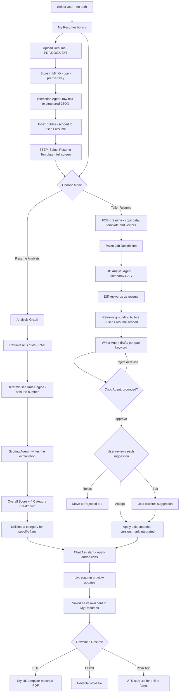
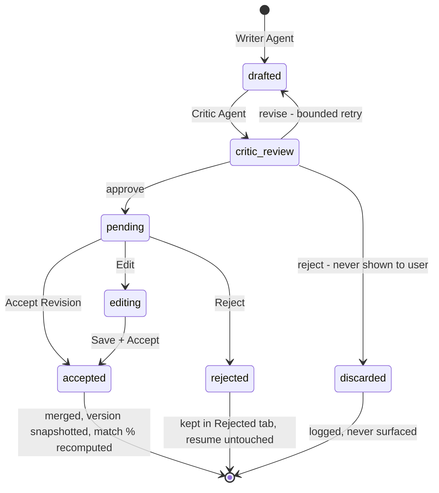
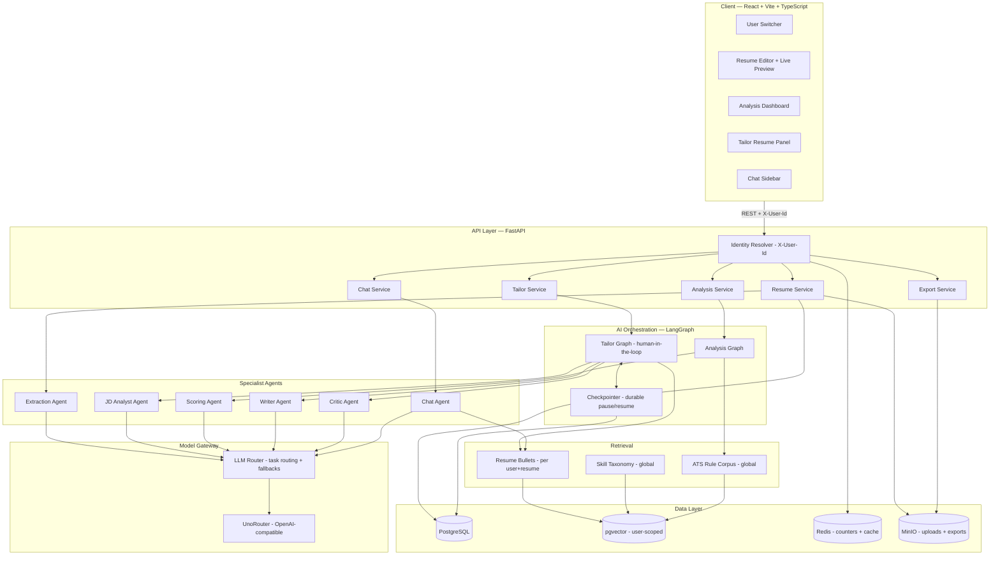
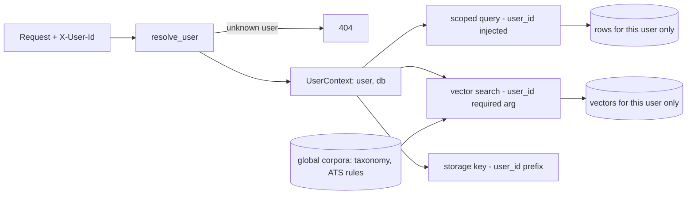
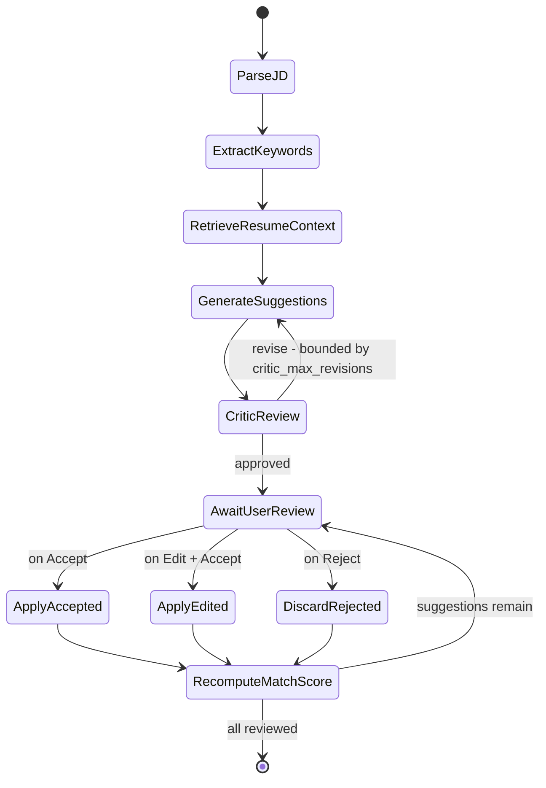
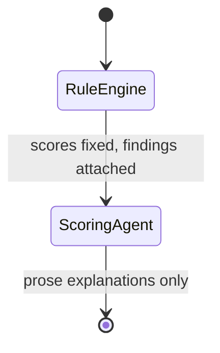
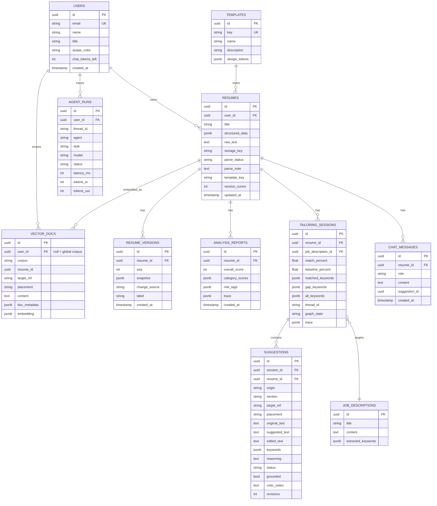
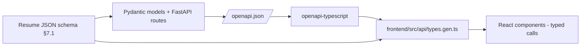
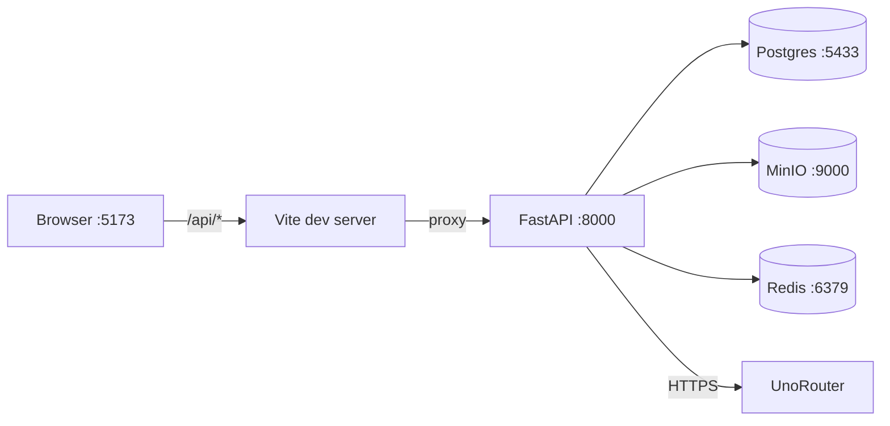

# ResumeAI — Product Design Document
### AI Resume Analysis & Tailoring Platform

**Status:** Design · **Owner:** Product/Eng

---

## 1. Executive Summary

ResumeAI is a web app where a job seeker uploads a resume, picks a visual template, and then uses two AI-powered modes to improve it:

- **Resume Analysis** — an ATS-style score (0–100) with a category-by-category breakdown and specific fixes.
- **Tailor Resume** — paste a job description and the app rewrites resume bullets to close keyword gaps, with every AI change surfaced as an **Accept / Reject / Edit** card so the user stays in control.

A persistent AI chat sits alongside the editor for open-ended help, and the resume renders live so changes are visible immediately.

### Operating parameters

| Parameter | Decision |
|---|---|
| Deployment | Runs locally via `docker compose`; single node |
| Authentication | **None.** Active user resolved from an `X-User-Id` header |
| Users | 5 seeded local users, chosen from a UI switcher |
| Scoping | Per-user — one user's resume content never grounds another user's suggestions |
| Model gateway | UnoRouter (`https://api.unorouter.com/v1`), OpenAI-compatible |
| Primary model | `gemini-3.5-flash-lite:free` (1M context) |
| Orchestration | LangGraph multi-agent graphs with human-in-the-loop interrupts |
| Retrieval | RAG over pgvector — three corpora |
| Object storage | MinIO (S3 API) |
| Input / output | PDF, DOCX, TXT in · PDF, DOCX, TXT out |
| Language | English resumes first |

---

## 2. Goals & Non-Goals

**Goals**
- Parse an uploaded resume into structured, editable data with high fidelity.
- Score resumes against ATS/recruiter heuristics and explain *why*, not just *what*.
- Tailor a resume to a job description while keeping every claim truthful — grounded in the user's actual content, no fabricated experience.
- Keep the human in the loop: every AI edit is reviewable before it touches the document.
- Route across multiple models so the product isn't single-vendor dependent and can fail over or route by cost.
- Keep the five local users independent — enforced structurally, not by convention.
- Make agent behaviour auditable without an external tracing SaaS.

**Non-goals**
- Job board integration / application tracking.
- Cover letter generation (a fast-follow on the same pipeline).
- Multi-language resumes.
- Multi-tenancy. One workspace, five users. §6.2 records what re-adding tenancy would cost.
- Authentication, authorization, billing. Scoping here is **data hygiene, not a security boundary** — see §12.
- Horizontal scale. Single-node by design.

---

## 3. User Flow


```mermaid
flowchart TD
    A[Select User - no auth] --> A2[My Resumes library]
    A2 --> B[Upload Resume - PDF/DOCX/TXT]
    B --> B2[Store in MinIO - user-prefixed key]
    B2 --> C[Extraction Agent: raw text to structured JSON]
    C --> C2[Index bullets - scoped to user + resume]
    C2 --> D[STEP: Select Resume Template - full screen]
    D --> E{Choose Mode}
    A2 --> E

    E -->|Resume Analysis| F[Analysis Graph]
    F --> F1[Retrieve ATS rules - RAG]
    F1 --> F2[Deterministic Rule Engine - sets the number]
    F2 --> F3[Scoring Agent - writes the explanation]
    F3 --> G[Overall Score + 4 Category Breakdown]
    G --> H[Drill into a category for specific fixes]

    E -->|Tailor Resume| I0[FORK resume - copy data, template and vectors]
    I0 --> I[Paste Job Description]
    I --> J[JD Analyst Agent + taxonomy RAG]
    J --> J2[Diff keywords vs resume]
    J2 --> K1[Retrieve grounding bullets - user + resume scoped]
    K1 --> K2[Writer Agent drafts per gap keyword]
    K2 --> K3{Critic Agent: grounded?}
    K3 -->|reject or revise| K2
    K3 -->|approve| L{User reviews each suggestion}

    L -->|Accept| M[Apply edit, snapshot version, mark integrated]
    L -->|Reject| N[Move to Rejected tab]
    L -->|Edit| O[User rewrites suggestion] --> M

    H --> P[Chat Assistant - open-ended edits]
    M --> P
    P --> Q[Live resume preview updates]
    Q --> Q2[Saved as its own card in My Resumes]
    Q2 --> R{Download Resume}
    R -->|PDF| S1[Styled, template-matched PDF]
    R -->|DOCX| S2[Editable Word file]
    R -->|Plain Text| S3[ATS-safe .txt for online forms]
```

---

## 4. Screen-by-Screen UX Spec

### 4.1 User Switcher (top bar)
One dropdown, five seeded users. Switching re-scopes every panel — resume list, analysis, tailoring sessions, chat history. The active user is sent as `X-User-Id` on every request. This replaces a login screen.

### 4.1.1 Theme toggle (top bar)
A sun/moon button beside the user switcher, present on every screen (library, template step, workspace).

- **Stored per user, not per browser.** Five demo personas share one machine, so a single global key would mean switching user silently rewrote someone else's preference. The key is `resumeai.theme.{user_id}`.
- A user who has never chosen inherits the `anonymous` slot, so a theme picked before a user is resolved is not thrown away on first switch.
- **Dark is the product default**; an unreadable or missing stored value falls back to it rather than throwing.
- The class is applied by an inline script in `index.html` that runs **before the bundle**, because setting it from React paints one dark frame first and reads as a flicker. That script duplicates the storage-key format on purpose — it cannot import — so the two must be changed together.
- The button shows the theme you would *get* (a sun while dark), with an `aria-label` that says so in words.
- Light-theme pairs were checked against WCAG AA; note the brand inversion trap in `index.css` §3 — `#4737FF` is unusable as text on dark and `--brand-400` is unusable on light, so the same role takes opposite values per theme.

### 4.2 My Resumes (home)
- Landing screen. Every resume — base or tailored — is a card.
- Tabs **All / Base / Tailored** with counts, plus title/role search.
- Each card: live thumbnail of the real content, inline rename, `Tailored: <role at company>` subtitle, relative "last updated", strength ring, a primary action (**Tailor to a job** / **Continue Tailoring**) and an overflow menu (Duplicate, Open editor, Delete).
- Strength bands are **<60 Needs work · 60–79 Good · 80+ Strong**. A resume that has never been analysed shows `–` and "Not analysed yet", **not 0%** — zero would read as a terrible resume rather than an unmeasured one.
- Analysis is never run automatically; the score appears once the user runs it from the editor.

### 4.2.1 Resume forking
Tailoring **forks** the resume rather than editing it in place, which is what lets one base serve many applications while staying pristine.

| Copied | Not copied |
|---|---|
| `structured_data`, `template_key`, `raw_text`, `storage_key` | versions, analyses (a fork starts its own history) |
| **grounding vectors** | |

The vector copy is load-bearing, not an optimisation: the writer agent retrieves grounding bullets scoped to `resume_id`, so an unindexed fork would silently produce weaker, ungrounded suggestions with no error anywhere.

Columns on `resumes`: `kind` (`base` \| `tailored`), `parent_id` (nullable self-FK), `tailored_for` (denormalised JD label for the card subtitle).

**Deleting a base orphans its forks rather than cascading** — deleting your base must never silently delete the tailored versions already sent to employers. Orphaning is done explicitly in the service, not via `ON DELETE SET NULL`, because SQLite does not enforce FK actions unless `PRAGMA foreign_keys` is on and the behaviour must not differ between backends.

A fork shares its parent's `storage_key`, so deletion only removes the uploaded object when **no other resume references it**.

### 4.3 Import Resume (modal)
- Fields: Resume Name, drag-and-drop upload (PDF/DOCX/TXT), live preview pane.
- On upload: validate type and size → store in MinIO under `{user_id}/{resume_id}/{filename}` → trigger async parse → spinner → editor once parsed.
- Parsing reads the file back *out of object storage*, so the pipeline is identical whether storage is MinIO or real S3.

### 4.4 Template Selection (step)
- A **forced full-screen step** immediately after upload and extraction — not a modal. After extraction the user has never seen their resume rendered, so this is the first moment the parse becomes visible and it doubles as a "did we read your file correctly?" check. A quiet warning appears when extraction looks thin (no experience entries, or a missing name/email).
- The same grid is reachable later from the workspace as a modal to change template; both render one shared `TemplateGrid`, so they cannot drift.
- Grid of **7 templates**, each rendered with the user's *actual* parsed content once parsing completes, so the choice is realistic.
- Each card shows the template name, its description, a scaled full-page live preview, and a footer summarising the typeface, density and header style.
- Non-destructive: content is decoupled from layout, so switching never loses data.

#### Design-token contract
Styling lives in `templates.design_tokens` (JSONB), defined once in `seed.py` and read by **both** renderers — the live HTML preview and the fpdf2 exporter. Adding or restyling a template is therefore a **backend-only change**; no frontend edit is required, and the preview cannot drift from the downloaded file.

| Token | Values | Effect |
|---|---|---|
| `font` | `sans` \| `serif` | Helvetica or Times (fpdf2 core fonts — no font files ship) |
| `heading` | `rule` \| `underline` \| `plain` \| `boxed` \| `sidebar` | Section-heading treatment; `rule` tints its line with the accent |
| `name_align` | `left` \| `center` | Header alignment |
| `accent` | hex or `""` | Name and heading colour; `""` inherits ink |
| `density` | `airy` \| `normal` \| `dense` | Line height and heading gap |
| `caps` | bool | Uppercase section headings |
| `divider` | bool | Rule under the contact block |
| `header` | `stacked` \| `split` | Name above contact, or name left / contact flush right |
| `entry` | `stacked` \| `inline` | Role above company, or `Role - Company` on one line |
| `skill_columns` | 1–3 | Skills laid out as a column grid |

A `split` header requires `name_align: left` — centring the name while floating contact right would collide. This is asserted in the test suite.

| Template | Font | Header | Entry | Cols | Accent |
|---|---|---|---|---|---|
| Modern | sans | stacked | stacked | 2 | `#4737ff` |
| Executive | serif | split | stacked | 3 | `#A2643C` |
| Balanced | sans | stacked | stacked | 1 | `#5F8A7D` |
| Classic | serif | stacked | stacked | 1 | — |
| Minimal | sans | stacked | stacked | 2 | — |
| Compact | sans | split | inline | 3 | — |
| Technical | sans | stacked | inline | 3 | `#3529bf` |

Dates are flushed to the right margin in every template — that is what makes a printed resume scannable by date. `contact.headline` (the professional title under the name) is optional and renders only when present; the parser extracts it from the line following the name, rejecting anything that looks like contact data or a section heading.

**Export caching:** the object key is `{user_id}/{resume_id}/v{version_cursor}-{template_key}.{fmt}`. The template key is part of the cache identity because applying a template does *not* bump `version_cursor`; without it the bucket would serve the previously rendered PDF forever.

**TXT is deliberately style-free** — it exists for ATS paste boxes, so the template must not affect it.

### 4.5 Main Workspace
- **Left** — tabs: "Resume Analysis" / "Tailor Resume". The active tab lives in the URL (`?tab=`), so "Continue Tailoring" is linkable and a refresh keeps your place.
- **Center** — AI chat: message history, quick-action chips, inline suggestion cards. See §4.5.1.
- **Right** — live rendered resume, zoom, "Templates & Settings", **Download**.

Entry points set the tab deliberately: the card's strength ring opens **Analysis**, its primary button opens **Tailor**. Arriving on the wrong tab would make the button feel broken.

#### 4.5.1 Chat assistant (centre pane)
The centre column is a **fixed 380px**, not a flexible one: chat lines past roughly 70 characters are hard to scan, and the spare width is better spent on the resume preview, which is the pane that benefits from it.

- Message history, user right / assistant left, with an empty state that states the review guarantee up front.
- **Quick-action chips are rendered verbatim from the backend `quick_actions` strings.** The backend owns that copy so the list can change without a frontend release; the UI adds no icons and keeps no local fallback list.
- **Chat never edits the resume directly.** A reply that proposes a change carries a `suggestion_id`, which renders as an inline Accept/Reject card and goes through the same review path as tailoring (`origin='chat'`, §5). This is what makes the assistant safe to trust: it cannot apply anything on its own, and it is prompt-bound never to claim it did.
- The user's own message appears optimistically and rolls back if the POST fails — waiting on a multi-agent round trip before echoing typed text reads as a hang. The assistant reply is never faked.
- **Message budget.** 25 per demo user (`users.chat_tokens_left`). The counter is hidden until 5 remain, then shows as a warning: a permanent counter makes a generous allowance feel like a meter running down. At zero the composer is **disabled with the reason shown**, because the backend returns 429 and letting the user type into a box that will reject them is worse than saying so.
- Three panes need width; below ~1280px the preview collapses and the tools + chat remain, since those are the working surfaces and the preview is reference.

### 4.6 Resume Analysis tab
- Empty state with a single **Run analysis** button — analysis is never automatic (it costs a model call, and an unrequested score on upload reads as a judgement nobody asked for).
- Once run: score ring, band label, **"N points to reach 80+"**, total finding count, role/level tags, and a re-run control.
- Four category cards (contact 15 / summary 20 / experience 45 / format 20) with progress bars and finding-count badges, expanding on click to list the notes.
- A 404 from `GET /resumes/{id}/analysis` is the **normal "never analysed" state**, not an error: the client treats it as an empty state and does not retry.

**Clickable findings — resolved.** The rule engine now emits structured `Finding` objects rather than plain note strings, and each one carries a `target_ref` (§8 grammar) naming the exact field it judged. `category_scores[c].notes` is still emitted, derived from `[f.message]`, so existing clients keep working.

```json
{
  "id": "experience.unquantified_bullets",
  "category": "experience",
  "target_ref": "exp_0.bullet_2",
  "severity": "high",
  "points": 7,
  "message": "Only 3 of 8 bullets are quantified",
  "fix_hint": "Add the number you moved: %, time saved, revenue, scale.",
  "action": "rewrite",
  "meta": { "quantified": 3, "total": 8 }
}
```

### 4.6.1 Guided step editor

A second mode of the Analysis tab (not a route, so the live preview stays mounted beside it and moves as the user types). The section list shows the four scoring categories; clicking one opens a focused step that pairs its recommendations with the editable fields they refer to.

- **`GET /resumes/{id}/analysis/steps`** backs it. Unlike `GET /analysis` it is **computed live from the current `structured_data` on every call**, so it never 404s on "never analysed" — the guided flow is what produces the first score — and a resolved recommendation disappears within one autosave of the keystroke that fixed it. A cached report would leave "+3 points" cards sitting under a field the user already corrected.
- **Autosave, no Save button** — debounced ~800 ms through `PUT /resumes/{id}/data`, flushed on step change and unmount so an arrow click cannot drop the last edit. Status is surfaced as Saving / Saved / Not saved rather than claimed silently.
- **"Fix this"** scrolls to and focuses the field named by `target_ref`, which is the payoff for making findings addressable.

**`+N points` is a contract, not decoration.** Each finding's `points` is computed as `max_achievable - awarded` for the single check that produced it, so resolving it raises `overall_score` by exactly N. This is enforced in three places: `backend/tests/test_findings.py` breaks a field, reads the promised number, fixes it and asserts the delta matches; `tests/test_steps_api.py` repeats the check end-to-end over HTTP; and `verify-api-surface.mjs` asserts it against the running server. A per-category assertion also guarantees findings never promise more than the category's remaining headroom. If that arithmetic ever stops holding, the badge should be removed rather than softened — a number the user can verify and catch being wrong costs more trust than showing none.

**Increment scope.** The guided editor now edits contact, summary, experience (with structured dates and location), education (field of study, grade, dates) and skills. The additional sections — certifications, languages, references, awards, publications and custom sections — are approved but still pending, because each one costs both exporter renderers plus the preview, and a field the PDF silently drops is its own kind of lie.

### 4.6.2 Structured dates

`experience`, `education` and `projects` carry `start_date`, `end_date` and `current` instead of one free-text `dates` string. That is what makes tenure, gap detection, ordering and a real "Present" label possible.

Two rules keep the migration honest:

1. **Never guess.** `split_dates()` accepts only ranges it is sure of — a whitespace-padded separator (`Jan 2020 – Present`, `March 2018 to June 2021`) or the tight numeric form (`2019-2022`). Anything else (`Summer 2020`, `Jan-2020`, a bare `2020`) is preserved verbatim in `raw_dates` and rendered exactly as written. A resume that misstates employment dates is far worse than one showing an odd string, and the editor offers to convert it rather than doing so silently.
2. **Never let display drift from data.** `resume_ops.date_label()` is the single accessor every renderer calls — both exporters, plain-text flattening and the scoring engine. The stored `dates` key is a derived mirror refreshed by `normalise_entry()` on every write, never an input once structured fields exist.

`migrate()` runs on parse, on `PUT /resumes/{id}/data` and on seed, and is idempotent, so parsed, seeded and hand-edited documents are the same shape from the first byte.

**The client implements the same rule twice, on purpose.** The preview renders the user's *unsaved* draft, so it cannot round-trip to the server for a label mid-keystroke; `src/lib/dates.ts` mirrors `date_label()`. Two copies of a rule drift, so `frontend/scripts/verify-date-parity.mjs` transpiles the real TypeScript module and compares it against the real backend across structured combinations, legacy migration and idempotence (33 checks, green against both the API and the mock).

**"Currently work here"** disables the end-date input rather than hiding it, and deliberately does **not** clear the stored value — mis-clicking a switch is easy, and silently destroying a date the user typed is not recoverable. `date_label()` ignores `end_date` whenever `current` is true, so a retained value can never leak into the rendered resume.

**PDF encoding.** The date split surfaced a latent export bug: `_latin1()` used `errors="replace"`, so the en-dash in a date range — and every curly quote, em-dash and ellipsis that Word and Google Docs autocorrect into pasted text — rendered as a literal `?`. It now transliterates to ASCII first and replaces only as a last resort. `tests/test_export_dates.py` renders all seven templates and asserts both that the dates appear and that no `?` survives.

### 4.7 Tailor Resume tab
- Empty state leads to the **job-description modal** (title + body, with a "Use sample JD" shortcut for demos).
- Starting a tailoring run **forks** the resume (§4.2.1), so the UI navigates to the **child**, not the base. Staying on the base would show an unchanged resume and look like a failure.
- Match % bar showing movement from the baseline, plus matched/gap keywords.
- Tabs: **Active** / **Already Matched** / **Rejected**, each with counts.
- Each card: keyword chips, placement (company · role), original text struck through, modified text with keywords highlighted, reasoning, critic notes, and **Accept / Reject / Edit**. Edit opens an inline textarea and accepts the user's own wording.
- Keyword highlighting escapes regex metacharacters and matches longest-first, so `C++` and `Node.js` survive and `Node.js` is not shadowed by `Node`.
- Cards show a **grounding badge** from the critic. Suggestions the critic rejected never render.

### 4.8 Download Resume
- **PDF** — default, template-styled; what most users submit.
- **DOCX** — editable Word file for manual tweaks or employers who request it.
- **TXT** — stripped of formatting, for ATS portals with "paste your resume" boxes.
- All three generated on demand from the same structured JSON (§7) — one source of truth, three renderers.
- Cached in the MinIO exports bucket keyed by **resume version**, so re-downloading an unchanged resume is a bucket read. Returns a presigned URL.

---

### 4.9 Routing

Navigation lives in the URL, not in application state.

| Route | Screen |
|---|---|
| `/` | redirect → `/resumes` |
| `/resumes` | My Resumes (library) |
| `/resumes/:id/template` | Template selection step |
| `/resumes/:id?tab=analysis\|tailor` | Workspace |
| `*` | redirect → `/resumes` |

**This reverses an earlier decision.** The original call — a `view` field in the reducer, on the grounds that a local-only app has "no URLs worth sharing" — was made when there were three flat views and no nested state. Adding the chat pane gave the workspace both a resume id and a tab, at which point three things stopped being acceptable: refresh always dumped the user on the library, "Continue Tailoring" could not be linked or put in a bug report, and browser Back did nothing, which reads as broken. The "nothing worth sharing" reasoning was wrong specifically for tab state: `?tab=tailor` is exactly how a defect gets reproduced.

What stays in the `AppState` reducer: `activeUserId`, `modal`, `zoom`, `theme`. **`activeUserId` is deliberately not in the URL** — it is identity, not a location, and a user id in a shareable link invites cross-user confusion in a 5-user demo. Switching user navigates home, because resume ids are per-user and the current `:resumeId` would 404.

Tab changes use `replace`, so Back leaves the workspace rather than stepping through tabs. The template step also redirects with `replace`: the wizard is one-way, and Back should not return to a choice already made.

---

## 5. AI Suggestion Lifecycle

Every AI-proposed change — from Tailor Resume *or* chat — is a **Suggestion**, never applied directly:

```json
{
  "id": "sugg_8f2a",
  "session_id": "tailor_sess_01",
  "origin": "tailor",
  "section": "experience.bullet",
  "target_ref": "exp_2.bullet_1",
  "original_text": "Scaled the LiDAR processing platform to 6 distinct workloads...",
  "suggested_text": "Scaled the LiDAR processing platform to 6 distinct microservices... implementing rigorous unit and integration testing...",
  "edited_text": null,
  "keywords": ["Unit Testing", "Integration Testing"],
  "reasoning": "Reinforces fault-isolation claim through disciplined QA, a key requirement for the target role.",
  "status": "pending",
  "grounded": true,
  "critic_notes": "Reframes existing testing work; introduces no new claims.",
  "revisions": 0
}
```

`origin` is `tailor` or `chat` — the chat assistant emits the same object type, which is what gives chat edits the same review control. `grounded` / `critic_notes` / `revisions` carry the critic's audit trail.


```mermaid
stateDiagram-v2
    [*] --> drafted: Writer Agent
    drafted --> critic_review: Critic Agent
    critic_review --> drafted: revise - bounded retry
    critic_review --> discarded: reject - never shown to user
    critic_review --> pending: approve
    pending --> accepted: Accept Revision
    pending --> rejected: Reject
    pending --> editing: Edit
    editing --> accepted: Save + Accept
    accepted --> [*]: merged, version snapshotted, match % recomputed
    rejected --> [*]: kept in Rejected tab, resume untouched
    discarded --> [*]: logged, never surfaced
```

Rules:
- `accepted` → resume JSON patched at `target_ref`, a new `resume_version` snapshot saved (every accept is undoable), match % recalculated.
- `rejected` → retained for the Rejected tab and audit trail, never applied.
- `edited` → user free-edits `suggested_text`; saving moves it to `accepted` with `edited_text` populated, and that is what merges.
- `discarded` → the critic judged it ungrounded. Logged for debugging, never rendered. The Active tab only ever contains suggestions that passed the grounding gate.
- Nothing is ever silently auto-applied. This is the core trust mechanism of the product.

---

## 6. System Architecture


```mermaid
flowchart TB
    subgraph Client["Client — React + Vite + TypeScript"]
        UI0[User Switcher]
        UI1[Resume Editor + Live Preview]
        UI2[Analysis Dashboard]
        UI3[Tailor Resume Panel]
        UI4[Chat Sidebar]
    end

    subgraph API["API Layer — FastAPI"]
        IDN[Identity Resolver - X-User-Id]
        RESUME_SVC[Resume Service]
        ANALYSIS_SVC[Analysis Service]
        TAILOR_SVC[Tailor Service]
        CHAT_SVC[Chat Service]
        EXPORT_SVC[Export Service]
    end

    subgraph AI["AI Orchestration — LangGraph"]
        AG[Analysis Graph]
        TG[Tailor Graph - human-in-the-loop]
        CKPT[Checkpointer - durable pause/resume]
    end

    subgraph Agents["Specialist Agents"]
        A1[Extraction Agent]
        A2[JD Analyst Agent]
        A3[Scoring Agent]
        A4[Writer Agent]
        A5[Critic Agent]
        A6[Chat Agent]
    end

    subgraph RAGL["Retrieval"]
        R1[Resume Bullets - per user+resume]
        R2[Skill Taxonomy - global]
        R3[ATS Rule Corpus - global]
    end

    subgraph Gateway["Model Gateway"]
        ROUTER[LLM Router - task routing + fallbacks]
        UNO[UnoRouter - OpenAI-compatible]
    end

    subgraph Data["Data Layer"]
        PG[(PostgreSQL)]
        VDB[(pgvector - user-scoped)]
        REDIS[(Redis - counters + cache)]
        MINIO[(MinIO - uploads + exports)]
    end

    Client -->|REST + X-User-Id| IDN
    IDN --> RESUME_SVC & ANALYSIS_SVC & TAILOR_SVC & CHAT_SVC & EXPORT_SVC
    RESUME_SVC --> PG & MINIO & A1
    ANALYSIS_SVC --> AG
    TAILOR_SVC --> TG
    CHAT_SVC --> A6
    EXPORT_SVC --> MINIO

    AG --> R3 & A3
    TG --> A2 & R1 & A4 & A5
    TG <--> CKPT
    A6 --> R1

    A1 & A2 & A3 & A4 & A5 & A6 --> ROUTER
    ROUTER --> UNO
    R1 & R2 & R3 --> VDB
    IDN --> REDIS
    CKPT --> PG
```

### 6.1 Why this shape
- **Templates are presentation, not user data.** Re-seeding updates template rows in place (users and resumes stay insert-only), so an existing database picks up restyled or newly added templates instead of being stranded on the old definitions.
- **Structured data is the source of truth**, not the rendered PDF. Parsing converts unstructured text into JSON once; templates render over that JSON, so switching templates or applying AI edits never means re-parsing.
- **AI orchestration is a separate layer** from API/CRUD, so prompts, retrieval and model routing evolve independently of the product API.
- **Everything AI produces flows through the Suggestion object** before touching the resume. This is what makes Accept/Reject/Edit possible everywhere, including chat.
- **Scoping is enforced at the lowest layer.** `user_id` is a required positional argument on every vector-search call and appears in the SQL `WHERE`. A developer who forgets it gets a `TypeError`, not a silent leak.
- **Agents are specialists, not one prompt.** One job, one prompt, one output schema, one model tier each.

### 6.2 Scoping model

Isolation is **user → resume**, enforced at four layers:

| Layer | Mechanism |
|---|---|
| **Schema** | `user_id` on every owned table, indexed, FK with `ON DELETE CASCADE` |
| **Query** | All reads go through `scoped(Model, user_id)`; single rows through `get_or_404(...)` |
| **Vector** | `user_id` is a **required argument** on `search()` and `index_documents()`, inside the SQL `WHERE` — not a post-filter |
| **Storage** | MinIO keys are `{user_id}/{resume_id}/{filename}`, so a bucket policy can enforce isolation at the storage layer too |

**Cross-user access returns 404, never 403.** A 403 confirms the resource exists; a 404 leaks nothing.

**Why scope at all with five users?** The alternative — one shared pool — means user A's bullets can be retrieved as grounding for user B's suggestions, producing rewrites that reference work the person never did. That is exactly the failure the critic agent exists to prevent. The cost of preventing it is one column and one `WHERE` clause.

**What is deliberately *not* scoped:** the skill taxonomy and ATS rule corpora are **global**. They are reference material containing no user data, so per-user copies would waste storage and embedding calls for no benefit.


```mermaid
flowchart LR
    REQ[Request + X-User-Id] --> RES[resolve_user]
    RES -->|unknown user| E404[404]
    RES --> CTX[UserContext: user, db]
    CTX --> SC[scoped query - user_id injected]
    CTX --> VEC[vector search - user_id required arg]
    CTX --> OBJ[storage key - user_id prefix]
    SC --> ROW[(rows for this user only)]
    VEC --> HIT[(vectors for this user only)]
    GLOB[(global corpora: taxonomy, ATS rules)] --> VEC
```

**If multi-tenancy is needed later:** add a `tenants` table, add `tenant_id` beside `user_id` on the owned tables, extend the scoping helper from two arguments to three, and add `tenant_id` to the `vec_store` index and predicate. The single scoping choke point — rather than filters scattered across call sites — is what keeps this a mechanical change of roughly 80 lines.

### 6.3 The agent roster

| Agent | Input | Output | Model tier | Retrieval |
|---|---|---|---|---|
| **Extraction** | Raw resume text | `ParsedResume` + `needs_review[]` + confidence | cheap | — |
| **JD Analyst** | Job description | `JDAnalysis` — title, seniority, 12–20 keywords | cheap | Skill taxonomy (global) |
| **Scoring** | Resume + rule findings | `AnalysisResult` — *prose only* | strong | ATS rules (global) |
| **Writer** | Gap keywords + retrieved bullets | `DraftBatch` of suggestions | strong | Resume bullets (user-scoped) |
| **Critic** | One draft + its original | `CriticVerdict` — approve/revise/reject | strong | — |
| **Chat** | Message + history + resume | `ChatDecision` — reply ± proposed edit | mid | Resume bullets (user-scoped) |

**Why a separate critic agent.** The writer is instructed not to fabricate, but instruction-following is probabilistic and the failure mode is severe: a plausible invented credential that a candidate submits to a real employer. A second agent that only judges truthfulness — with no incentive to produce output — catches what the first missed. This is the single most important agent for product trust.

**The critic is backed by a deterministic check that cannot be talked out of.** Before the LLM critic runs, the orchestrator verifies the draft's `target_ref` resolves to a real bullet **in this user's resume**, and that `original_text` matches it verbatim. A draft citing a nonexistent bullet is dropped outright. The LLM critic then judges semantics; the code check guarantees provenance. Anti-hallucination is not left to a prompt.

### 6.4 Model gateway

One OpenAI-compatible endpoint fronting 200+ models, which preserves multi-provider redundancy without three SDK integrations.

- **Base URL** `https://api.unorouter.com/v1` · **Primary** `gemini-3.5-flash-lite:free`
- **Provider abstraction:** every agent calls `get_llm(task)`; the chat-model class is instantiated in exactly one file. Note the SDK takes `base_url` / `api_key` as field aliases.
- **Fallback chain:** `with_fallbacks()` — `gemini-3.5-flash-lite:free` → `gemini-3.1-flash-lite` → `gpt-oss-120b:free`, on error, timeout or rate-limit.
- **Cost/quality routing:** per-task config (`model_extract`, `model_rewrite`, `model_critic`, …), each defaulting to `model_default`. Upgrading bullet rewriting is one `backend/.env` line.
- **Key handling:** `UNOROUTER_API_KEY` from `backend/.env` — never committed, never in the database, and never reachable from the browser bundle (§14.1). A real secrets manager is deferred (§12).
- **Usage limits:** per-user `chat_tokens_left`, decremented per call, surfaced as the "Chat tokens left" counter. Exhaustion returns HTTP 429.
- **Graceful degradation:** with no API key the system still runs. A regex resume parser, deterministic keyword extraction and the rule-based scoring engine all work offline; only prose explanations and bullet rewriting go quiet.

### 6.5 Retrieval

| Corpus | Contents | Consumed by | Scope |
|---|---|---|---|
| `resume_bullets` | One doc per bullet/summary, tagged with `target_ref` and placement | Writer, Chat | **user + resume** |
| `skill_taxonomy` | ~200 alias→canonical pairs (`k8s` → `Kubernetes`) | JD Analyst | global |
| `ats_rules` | ATS best-practice rules in prose | Scoring | global |
| `exemplars` *(later)* | Anonymized high-scoring resumes | Writer | global, consent-gated |

**Storage:** pgvector with an `ivfflat` cosine index; `user_id` in both the index and the query predicate for `resume_bullets`. On SQLite the same interface falls back to numpy cosine — same results, no ANN index.

**Embeddings:** `gemini-embedding-2:free` via UnoRouter, probed at startup to discover its true dimension. That model reports roughly 74% success on the provider's own statistics, so a **deterministic local hashing embedding** (blake2b-hashed tokens into a fixed-dimension vector, L2-normalised) stands in when it fails. Retrieval quality drops; retrieval availability does not.

**An honest note on whether retrieval earns its place.** A single resume is ~1,575 tokens against a 1M-token context window, so retrieval is *not* needed to fit user content into a prompt. The justifications, in descending order of strength:

1. **The taxonomy and ATS corpora** — ~210 reference documents that genuinely don't belong inline in every prompt. This is the strongest case.
2. **Ranking** — focusing the writer on the 3 most relevant bullets per gap keyword rather than all 26. Real, though a keyword-overlap score would also achieve it.
3. **The exemplar corpus, if added** — cross-user anonymized high-scoring resumes. A genuine retrieval problem, but not built.

For `resume_bullets` specifically, the vector store is closer to a ranking convenience than a necessity. It is specified because the infrastructure is shared with (1) and (3) and costs little on top. A future reviewer deciding whether to keep this layer should weigh it on those terms.

### 6.6 Hybrid scoring — why numbers come from code

The scoring agent is explicitly forbidden from setting scores. A deterministic rule engine computes all four category scores; the LLM writes explanations only, and the orchestrator overwrites any number the model returns.

Three reasons: **stability** — re-running analysis on an unchanged resume must not move the score, or users stop trusting it immediately; **explainability** — §12 demands rules rather than opinion, and the way to get explainable rules is to write them as code; and **cost** — scoring needs no strong model if it isn't doing arithmetic.

| Category | Weight | Deterministic checks |
|---|---|---|
| Contact & Profile | 15 | email present/valid, phone, location, professional title, portfolio link |
| Summary | 20 | present, 40–70 words, no first person, no clichés, quantified |
| Experience | 45 | quantification ratio, action-verb openers, passive openers, bullet length band, bullets per role, date sanity |
| Format & Structure | 20 | skills section, education, total length, date-format consistency, duplicate bullets, parse confidence |

Each check emits a `Finding` alongside its score, carrying the `points` that resolving it is worth — derived from the same arithmetic that awarded the score (`max_achievable - awarded`), never estimated separately. That is what lets the guided editor (§4.6.1) promise "+N points" and be right.

### 6.7 Tailor Resume — sequence

```mermaid
sequenceDiagram
    participant U as User
    participant FE as Frontend
    participant API as Tailor Service
    participant G as LangGraph
    participant VDB as pgvector
    participant W as Writer
    participant C as Critic

    U->>FE: Paste job description
    FE->>API: POST /resumes/{id}/tailor  (X-User-Id)
    API->>G: invoke(thread_id, user_id, resume, jd)
    G->>VDB: taxonomy lookup (global corpus)
    G->>G: JD Analyst -> keywords
    G->>G: diff vs resume -> matched / gaps
    G->>VDB: retrieve grounding bullets (user + resume scoped)
    G->>W: draft per gap keyword
    W-->>G: drafts
    G->>G: verify target_ref + verbatim original (code)
    G->>C: audit each draft
    C-->>G: approve / revise / reject
    G->>G: rejected -> retry writer (bounded)
    G-->>API: interrupt() — graph SUSPENDS
    API-->>FE: suggestion cards + match %
    Note over G: state persisted; may resume days later
    U->>FE: Accept / Reject / Edit
    FE->>API: PATCH /suggestions/{id}
    API->>API: patch JSON, snapshot version, recompute match %
    API->>G: Command(resume=decision)
    API-->>FE: updated score + live preview
```

### 6.8 Tailor graph — state machine


```mermaid
stateDiagram-v2
    [*] --> ParseJD
    ParseJD --> ExtractKeywords
    ExtractKeywords --> RetrieveResumeContext
    RetrieveResumeContext --> GenerateSuggestions
    GenerateSuggestions --> CriticReview
    CriticReview --> GenerateSuggestions: revise - bounded by critic_max_revisions
    CriticReview --> AwaitUserReview: approved
    AwaitUserReview --> ApplyAccepted: on Accept
    AwaitUserReview --> DiscardRejected: on Reject
    AwaitUserReview --> ApplyEdited: on Edit + Accept
    ApplyAccepted --> RecomputeMatchScore
    ApplyEdited --> RecomputeMatchScore
    DiscardRejected --> RecomputeMatchScore
    RecomputeMatchScore --> AwaitUserReview: suggestions remain
    RecomputeMatchScore --> [*]: all reviewed
```

LangGraph is warranted here rather than a plain chain for two reasons: **human-in-the-loop interrupts**, where the graph must pause at `AwaitUserReview` and resume per-suggestion as the user acts; and the **critic retry loop**, a genuine cycle with a bounded counter.

**The pause must be durable.** `interrupt()` suspends mid-graph and a checkpointer persists the full state to disk, so a user can return days later — from a different machine — and continue where they left off. The pause point cannot live in process memory.

### 6.9 Analysis graph


```mermaid
stateDiagram-v2
    [*] --> RuleEngine
    RuleEngine --> ScoringAgent: scores fixed, findings attached
    ScoringAgent --> [*]: prose explanations only
```

Linear by design. The rule engine runs before the agent, and its scores are authoritative.

A `RetrieveATS` node used to sit in front of `RuleEngine`. It ran a generic
`"resume quality ats rules"` search into `state["ats_context"]`, which nothing ever
read — `ScoringAgent` performs its own search keyed on the categories that actually
scored badly. It was removed, halving the embedding calls per Analyze click for an
identical result.

**Free tier only.** Every configured model ends in `:free`, and
`free_models_only` (default on) strips any paid name from the fallback chain
before a request is sent, raising rather than silently billing if that leaves
nothing. The chain is ordered by measured reliability — `k2-horizon:free`
(100% uptime / 94.6% success / 208ms), then `glm-4.7-flash:free`, then
`gemma-4-26b:free` — because a fallback exists to answer when the model above
it did not.

**Optional sections are generic, and deliberately unscored.**
Certifications, languages, awards, publications, references and user-named
custom sections all share one shape — `extras: [{kind, title, entries[]}]`,
where an entry is `{primary, secondary, date, detail}` and the **preset supplies
the labels**. A field whose label is `""` is not part of that kind and is never
rendered, so a Languages entry is two inputs while a Publication is four. The
preview, the three exporters, the editor and the parser each carry one code
path instead of six, and a user-named section is not a special case.

They are a fifth step in the guided editor — navigable, and **worth no points**.
Scoring "do you hold certifications" would mark a novelist down for not being a
sysadmin: that critiques a career rather than a document. `WEIGHTS` is therefore
untouched, the step reports `score: 0, max: 0, status: "optional"`, and the
category emits no findings at all. `status` is `"optional"` rather than
`"clear"` because a green tick would claim completion for a step nobody opened.

`migrate()` backfills `extras: []` on read, so resumes stored before the feature
existed upcast with no migration and no reset.

The parser recognises the five standard headings and promotes an unrecognised
heading to a custom section **only if it is ALL-CAPS or ends in a colon**, and
only after a known heading has already been seen. Plain Title Case is rejected
because it is indistinguishable from a company name, and the leading-position
rule stops a candidate's own name from becoming a section.

**"Rewrite with AI" is one lifecycle, not two.**
`POST /resumes/{id}/sections/{target_ref}/rewrite` drafts a fix for a single
finding and persists it as an ordinary pending `Suggestion` with
`origin="analysis"` and `session_id=null`, so Accept / Reject / Edit and version
history work unchanged. The critic runs before the row is written: an ungrounded
draft is never stored and the caller gets 422 with the reviewer's note.

Only half of all findings offer it. `Finding.action` is `"rewrite"` for the
eight that point at editable text and `""` for the eight that do not — no model
can supply a missing phone number — so the card renders **"Rewrite with AI"** or
**"Go to field"** accordingly. `experience.no_bullets` is deliberately in the
second group: its `target_ref` is a container that does not resolve, and
drafting a first bullet from a job title alone is ungrounded invention.

Two prompt paths: *revise* for existing text, *compose* for
`summary.missing`, where the ref resolves to `""` and the summary must be built
from the experience already in the document.

**Accepting a suggestion is conflict-checked.** A suggestion records the
`original_text` it was written against. `apply_patch` only verifies the
`target_ref` still resolves, so accepting a stale suggestion used to silently
overwrite a newer hand-edit. `act()` now compares the live text first and
returns **409** (`StaleSuggestion` → `ConflictError`) if it moved, leaving the
suggestion pending so it can still be rejected. 409 is distinct from 422 on
purpose: nothing about the request is malformed, the world moved underneath it.

**The transport is not assumed to work.** Running the corpus against the live
provider found three faults that 400 passing offline tests could not see, and
the gateway is shaped around them.

*Free models accept `json_schema` and reply with markdown anyway.* The verdict
inside that markdown is usually correct, so discarding it loses real signal —
an early run reported "the LLM critic is adding nothing" when every call had in
fact been a correctly-reasoned rejection thrown away by a JSON parse.
`llm.structured()` therefore falls down a salvage ladder: the provider's own
parse (`ok`), then JSON embedded in prose or a code fence (`ok-json`), then a
schema-declared prose reader (`ok-prose`). Each tier records a **distinct
status**, so a run carried by salvage never looks like one where structured
output worked. The prose reader **fails closed** — anything it cannot read
unambiguously returns `None` and degrades to the rules, because the dangerous
misparse ("I cannot approve this" read as approval) ships a fabrication.

*The free tier allows one request per minute per model per account.* A
six-draft tailor run made as six calls is guaranteed to be throttled partway
through, and a throttled critic silently becomes the rule engine. `review_batch`
therefore judges **every draft in one call**; `review_draft` is a one-element
batch, so the corpus measures the same code path production runs.

*Not every failure is a model failure.* `llm.classify()` separates
`rate_limited`, `timeout`, `transient` (provider 503s) and `unparsable` from a
plain `error`. A throttled model has said nothing about its own quality, and
recording it as an error is how a transport problem came to be reported as a
quality verdict. A short `retry in Ns` hint is waited out once, within a
bounded budget, rather than burning the rest of the chain on the same limit.

**A degraded critic is visible.** When the LLM critic errors, `review_draft`
falls back to `_rule_critique`. That fallback catches numeric fabrication
(5/5 in the corpus) and is blind to semantic fabrication (0/8) — invented
technologies, inflated seniority, changed verbs. Silently swapping one for the
other is the worst failure this system has, so the fallback is marked
`status="degraded"`, counted in the graph trace, and written to `agent_runs`
where `/admin/agent-runs` shows it. Running rules-only with no API key is *not*
a degradation; it is the documented offline mode.

**The critic is measured, not assumed.** `tests/critic_cases.py` holds 18
labelled rewrites — 13 fabrications split into numeric and semantic, 5 faithful
rewrites that must not be rejected. Two rates are tracked: recall on
fabrications and false rejections on faithful text, because optimising either
alone is trivial and useless. Offline it pins the rule engine's exact envelope;
`make critic-report-llm` scores the live model, paced past the rate limit.

The report distinguishes three outcomes by exit code, because "the critic is no
better than the rules" and "the critic never ran" are not the same claim:
**0** the LLM wins, **1** it does not beat the rules, **2** inconclusive — every
call degraded, so the run says nothing. It also reports *how* answers arrived
(`json_schema` vs salvage) and flags a rise in false rejections, since a
stricter critic and a better one look identical in the recall column alone.

**Reasoning effort is per task.** The default model runs at *medium* thinking
effort. The critic only compares two short strings and returns
`{approved, notes, severity}`, so `TASK_EFFORT` sends `reasoning_effort:
minimal` for that task alone; every other task omits the field and is unchanged.
This was chosen over routing the critic to a different model: the faster-looking
free alternatives are reasoning models that are 3–4× slower end to end, and the
fastest of them advertises no structured-output support — which `review_draft`
would have swallowed as a silent fall back to the three-phrase rule critic.

**Embeddings are local.** The free remote embedder reports 24.3% success, and
the pgvector column is `Vector(384)`, which hosted embedding models do not
emit — so a *successful* remote call is the case that breaks the insert, and a
mixed index makes cosine similarity meaningless. One consistent space beats a
24% chance of a better one at this corpus size. `EMBEDDINGS_REMOTE=true` opts
back in.

**Parsing.** PDF text is extracted with `pdfplumber`, with `pypdf` as a fallback.
Two-column resumes are detected by finding a vertical gutter no word crosses
(`_column_split_x`) and reading each column in order — without this the page
comes out interleaved row by row and the segmenter reads one nonsensical
document. Wrapped bullets that lost their glyph are rejoined conservatively,
date-only lines attach to the entry above rather than replacing it, and
`POST /resumes/{id}/reparse` re-reads a stored upload with the current parser
(recording a version first, since it discards manual edits). Parser fixes do not
otherwise reach resumes that were already parsed.

**Scoring precision.** Term matching is word-boundary based via
`app/services/text_match.py`, not substring: `"Go"` must not be satisfied by *going*,
and a JD asking for `k8s` is satisfied by a resume that writes `Kubernetes`. Bullet
length has two deliberate numbers — `BULLET_COACHED_MAX = 30` (what we advise and what
the Writer targets) and `BULLET_HARD_CAP = 45` (where points are actually deducted).
Both live in `heuristics.py`; coaching tighter than we penalise is intentional.

---

## 7. Data Model


```mermaid
erDiagram
    USERS ||--o{ RESUMES : owns
    USERS ||--o{ VECTOR_DOCS : scopes
    USERS ||--o{ AGENT_RUNS : traces
    RESUMES ||--o{ RESUME_VERSIONS : has
    RESUMES ||--o{ ANALYSIS_REPORTS : has
    RESUMES ||--o{ TAILORING_SESSIONS : has
    RESUMES ||--o{ VECTOR_DOCS : embedded_as
    RESUMES ||--o{ CHAT_MESSAGES : has
    TAILORING_SESSIONS ||--o{ SUGGESTIONS : contains
    TAILORING_SESSIONS }o--|| JOB_DESCRIPTIONS : targets
    TEMPLATES ||--o{ RESUMES : styles

    USERS {
        uuid id PK
        string email UK
        string name
        string title
        string avatar_color
        int chat_tokens_left
        timestamp created_at
    }
    RESUMES {
        uuid id PK
        uuid user_id FK
        string title
        jsonb structured_data
        text raw_text
        string storage_key
        string parse_status
        text parse_note
        string template_key
        int version_cursor
        timestamp updated_at
    }
    RESUME_VERSIONS {
        uuid id PK
        uuid resume_id FK
        int seq
        jsonb snapshot
        string change_source
        string label
        timestamp created_at
    }
    TEMPLATES {
        uuid id PK
        string key UK
        string name
        string description
        jsonb design_tokens
    }
    ANALYSIS_REPORTS {
        uuid id PK
        uuid resume_id FK
        int overall_score
        jsonb category_scores
        jsonb role_tags
        jsonb trace
        timestamp created_at
    }
    JOB_DESCRIPTIONS {
        uuid id PK
        string title
        text content
        jsonb extracted_keywords
    }
    TAILORING_SESSIONS {
        uuid id PK
        uuid resume_id FK
        uuid job_description_id FK
        float match_percent
        float baseline_percent
        jsonb matched_keywords
        jsonb gap_keywords
        jsonb all_keywords
        string thread_id
        string graph_state
        jsonb trace
    }
    SUGGESTIONS {
        uuid id PK
        uuid session_id FK
        uuid resume_id FK
        string origin
        string section
        string target_ref
        string placement
        text original_text
        text suggested_text
        text edited_text
        jsonb keywords
        text reasoning
        string status
        bool grounded
        text critic_notes
        int revisions
    }
    CHAT_MESSAGES {
        uuid id PK
        uuid resume_id FK
        string role
        text content
        uuid suggestion_id
        timestamp created_at
    }
    VECTOR_DOCS {
        uuid id PK
        uuid user_id FK "null = global corpus"
        string corpus
        uuid resume_id
        string target_ref
        string placement
        text content
        jsonb doc_metadata
        jsonb embedding
    }
    AGENT_RUNS {
        uuid id PK
        uuid user_id FK
        string thread_id
        string agent
        string task
        string model
        string status
        int latency_ms
        int tokens_in
        int tokens_out
    }
```

Two supporting notes. `tailoring_sessions.thread_id` links a database row to its LangGraph checkpoint, which is how a paused graph is found again after a restart. `vector_docs.user_id` is nullable — `NULL` marks a global corpus.

### 7.1 Resume JSON schema

The contract that makes surgical edits possible. `target_ref` strings address into it, so Accept patches one bullet rather than rewriting the document.

Entries are addressed by **position**, not by a stored `id` — `exp_2.bullet_1` is the third experience entry's second bullet. Positional addressing keeps the document small and the patch logic trivial; the cost is that reordering invalidates outstanding refs, which is why a reorder and an open suggestion list are not allowed to overlap.

```jsonc
{
  "contact": {
    "name": "", "headline": "", "email": "", "phone": "",
    "location": "", "links": ["github.com/you"]        // plain strings
  },
  "summary": { "text": "" },
  "experience": [
    {
      "company": "", "role": "", "location": "",
      "start_date": "Mar 2021",   // free text: "2019", "Jan 2020", "01/2020"
      "end_date": "",             // ignored while `current` is true
      "current": true,
      "raw_dates": "",            // set ONLY when a legacy string was unsplittable
      "dates": "Mar 2021 – Present",  // DERIVED mirror — never written by a client
      "bullets": [""]             // plain strings
    }
  ],
  "education": [
    { "school": "", "degree": "", "field_of_study": "", "location": "",
      "grade": "", "start_date": "", "end_date": "", "current": false, "dates": "" }
  ],
  "projects": [
    { "name": "", "role": "", "url": "", "tech": [],
      "start_date": "", "end_date": "", "current": false, "dates": "",
      "bullets": [] }
  ],
  "skills": [{ "label": "Languages", "items": ["Python", "TypeScript"] }]
}
```

Dates are free text rather than ISO, deliberately: resumes say "Summer 2020" and "Q3 2019", and forcing a date picker would either reject those or silently rewrite them. See §4.6.2 for the migration rules and the single `date_label()` accessor.

Valid `target_ref` forms: `summary.text`, `exp_2.bullet_1`, `prj_1.bullet_0`, `skills.0.items`, plus the contact fields (`contact.email`, `contact.links`) that analysis findings address.

---

## 8. API Endpoints

Every endpoint accepts `X-User-Id` (or `?user_id=` for curl convenience). Omitted → the first seeded user.

| Method | Endpoint | Purpose |
|---|---|---|
| GET | `/api/health` | DB dialect, pgvector, storage mode, LLM configured |
| GET | `/api/users` | The 5 seeded users, for the switcher |
| GET | `/api/templates` | List templates |
| GET | `/api/sample-jd` | Sample job description for first-run demo |
| GET | `/api/resumes` | List resumes (user-scoped) |
| POST | `/api/resumes/upload` | Upload PDF/DOCX/TXT → MinIO → async parse |
| GET | `/api/resumes/{id}` | Fetch one resume |
| GET | `/api/resumes/{id}/parse-status` | Poll the parse job |
| PUT | `/api/resumes/{id}/data` | Manual edit from the preview |
| POST | `/api/resumes/{id}/template` | Apply or switch template |
| POST | `/api/resumes` | Create a blank resume |
| POST | `/api/resumes/{id}/fork` | Copy a resume (data, template, vectors) |
| PATCH | `/api/resumes/{id}` | Rename |
| DELETE | `/api/resumes/{id}` | Purge rows, vectors and objects |
| POST | `/api/resumes/{id}/analyze` | Run the analysis graph |
| GET | `/api/resumes/{id}/analysis` | Latest score + breakdown (**404 = never analysed**) |
| GET | `/api/resumes/{id}/analysis/steps` | Guided-editor steps + findings, recomputed live (**never 404s on "not analysed"**) |
| POST | `/api/resumes/{id}/tailor` | Start tailoring; runs to the first interrupt |
| GET | `/api/resumes/{id}/tailor` | List tailoring sessions |
| GET | `/api/resumes/{id}/tailor/{sid}/suggestions` | Active / matched / rejected |
| PATCH | `/api/suggestions/{id}` | Accept / Reject / Edit |
| GET | `/api/resumes/{id}/chat` | History + quick actions + token count |
| POST | `/api/resumes/{id}/chat` | Send a message; may emit a Suggestion |
| GET | `/api/resumes/{id}/versions` | Version history |
| POST | `/api/resumes/{id}/undo` · `/redo` | Walk the version cursor |
| GET | `/api/resumes/{id}/export?format=pdf\|docx\|txt` | Render + download |
| GET | `/api/admin/agent-runs` | Local agent trace |

---

## 9. Tech Stack

| Layer | Choice | Why |
|---|---|---|
| Frontend | React + Vite + TypeScript + Tailwind | No SSR need for a local 3-pane editor; Vite starts fast and proxies `/api` cleanly |
| Backend | FastAPI (Python) | LangGraph is most mature in Python; async-friendly for streaming |
| Orchestration | LangGraph + LangChain | Stateful graphs with human-in-the-loop interrupts and a durable checkpointer |
| Model gateway | UnoRouter | One OpenAI-compatible endpoint fronting 200+ models |
| Embeddings | `gemini-embedding-2:free` + local hashing fallback | Provider reports ~74% success; the system must not hard-fail on it |
| Vector store | pgvector, numpy fallback | One database to operate; fallback keeps SQLite mode working |
| Primary DB | PostgreSQL, SQLite fallback | App must boot without Docker |
| Cache | Redis | Token counters, cached LLM calls |
| Async jobs | FastAPI `BackgroundTasks` | Parsing is ~200ms plus one LLM call; a Celery worker is overhead at this scale |
| Object storage | MinIO (S3 API) | Real S3 semantics locally; port to S3/R2 is endpoint + credentials |
| PDF rendering | fpdf2 over a shared renderer | Avoids a ~150MB Chromium per machine; Playwright is the fidelity upgrade |
| Auth | None — `X-User-Id` | Out of scope; §12 |
| Observability | `agent_runs` table | Local-first tracing, no external SaaS |
| Deployment | docker compose, single node | Local build |

### 9.1 Infrastructure

| Service | Image | Ports |
|---|---|---|
| Postgres + pgvector | `pgvector/pgvector:pg16` | `5433:5432` — 5433 avoids clashing with a local 5432 |
| Redis | `redis:7-alpine` | `6379` |
| MinIO | `quay.io/minio/minio` | `9000` API, `9001` console |
| MinIO init | `quay.io/minio/mc` | one-shot; creates `resumeai-uploads` and `resumeai-exports`, then exits |

### 9.2 Fallback matrix

Every external dependency has a defined degradation path, so the app always boots:

| Dependency | Unavailable → | Consequence |
|---|---|---|
| PostgreSQL | SQLite file | No ANN index; numpy cosine instead |
| pgvector | numpy cosine | Slower at scale, identical results |
| MinIO | Local disk under `data/` | No presigned URLs |
| Embedding endpoint | Local hashing embedding | Lower retrieval quality |
| LLM / no API key | Regex parser + rule engine | Analysis and keyword matching still work; no rewriting or prose |

### 9.3 Repository layout — single monorepo

One git repository holds both deployables. The backend and frontend are developed, versioned and released together, and they share one contract (§9.4) — splitting them across repos would mean coordinating two commits for every API change and inventing a version-negotiation problem that doesn't otherwise exist.

```
resumeai/
├── README.md
├── DESIGN.md
├── Makefile                      # single entry point for every task
├── docker-compose.yml            # Postgres+pgvector, Redis, MinIO, minio-init
├── .gitignore
│
├── backend/                      # FastAPI + LangGraph
│   ├── .env                      # server settings + secrets (git-ignored)
│   ├── .env.example              # committed template; `make env-file` copies it
│   ├── environment.yaml          # conda env — dependency source of truth
│   ├── pyproject.toml            # ruff + pytest config
│   ├── app/
│   │   ├── main.py               # routes, startup, CORS
│   │   ├── config.py             # env settings, per-task model routing
│   │   ├── db.py                 # engine, pgvector, SQLite fallback
│   │   ├── identity.py           # X-User-Id resolution + query scoping
│   │   ├── models.py             # SQLAlchemy tables (§7)
│   │   ├── schemas.py            # API request/response contracts
│   │   ├── ai/
│   │   │   ├── llm.py            # model gateway, fallback chain
│   │   │   ├── agents.py         # the six specialists (§6.3)
│   │   │   ├── prompts.py
│   │   │   ├── graphs.py         # analysis + tailor graphs, checkpointer
│   │   │   ├── vectorstore.py    # user-scoped retrieval (§6.5)
│   │   │   ├── heuristics.py     # deterministic rule engine (§6.6)
│   │   │   ├── taxonomy.py       # skill aliases, keyword matching
│   │   │   └── resume_ops.py     # target_ref addressing + patching
│   │   └── services/
│   │       ├── storage.py        # MinIO, disk fallback
│   │       ├── parsing.py
│   │       ├── analysis.py
│   │       ├── tailoring.py
│   │       ├── suggestions.py    # accept/reject/edit lifecycle
│   │       ├── chat.py
│   │       ├── export.py         # PDF / DOCX / TXT
│   │       └── seed.py
│   └── tests/
│       ├── test_isolation.py     # acceptance gate 1
│       ├── test_interrupt.py     # acceptance gate 2
│       ├── test_determinism.py   # acceptance gate 3
│       └── test_grounding.py     # acceptance gate 4
│
├── frontend/                     # React + Vite + TypeScript
│   ├── .env.local                # VITE_* only — inlined into the bundle
│   ├── .env.example              # committed template
│   ├── package.json
│   ├── vite.config.ts            # @ alias + proxies /api -> :8000
│   ├── mock-api.py               # standalone stub; frontend work without Postgres
│   ├── scripts/verify-gateway.mjs
│   ├── scripts/verify-api-surface.mjs
│   ├── scripts/verify-date-parity.mjs
│   └── src/
│       ├── main.tsx              # providers: Query, Router, AppState
│       ├── App.tsx               # shell: routes + the hoisted import modal
│       ├── app/                  # cross-cutting shell
│       │   ├── routes.tsx        # route table
│       │   ├── nav.ts            # typed navigation helpers (see note)
│       │   ├── UserSwitcher.tsx
│       │   └── ThemeToggle.tsx
│       ├── features/             # one folder per feature, colocated
│       │   ├── resumes/          # MyResumes, ImportResumeModal
│       │   ├── templates/        # ChooseTemplate, TemplateGrid, TemplateModal
│       │   ├── analysis/         # AnalysisPane, ScoreRing
│       │   ├── tailor/           # TailorPane, TailorModal
│       │   ├── chat/             # ChatPane
│       │   ├── preview/          # ResumePreview
│       │   └── workspace/        # Workspace (composes the three panes)
│       ├── components/ui/        # shadcn primitives ONLY
│       ├── api/
│       │   ├── client.ts         # axios: baseURL, X-User-Id, ApiError
│       │   └── queries.ts        # React Query hooks
│       ├── services/             # paths + payloads, no React (types.ts is the source)
│       └── lib/                  # AppState, theme, score, utils
```

**Feature-first, not type-first.** The earlier layout put every component in one flat `components/` bucket, which mixed generic primitives with feature panes — `ScoreRing` sat beside `AnalysisPane` with nothing marking one as reusable and the other as owned. A feature is now one folder rather than four greps. `components/ui/` stays type-grouped because those genuinely are shared primitives.

**Why `app/nav.ts` is separate from `app/routes.tsx`:** a file exporting both a component and hooks trips `react-refresh/only-export-components` and breaks Fast Refresh. Same reason `lib/score.ts` holds `band()` instead of `ScoreRing.tsx`.

**No Nx, Turborepo or Bazel.** Those earn their keep on many interdependent JavaScript packages with a build graph worth caching. This repo has two packages in two different languages with one dependency edge between them. A `Makefile` expresses that honestly and adds no configuration to learn:

| Command | Does |
|---|---|
| `make up` / `make down` | Start or stop the docker services |
| `make dev` | Services + API + UI together |
| `make api` / `make web` | Run one side alone |
| `make types` | Regenerate TypeScript types from the live OpenAPI schema |
| `make seed` | Reset and re-seed the database |
| `make test` | Backend test suite, including the §11 acceptance gate |
| `make clean` | Drop volumes, `data/`, caches |

### 9.4 The shared contract

**A probe must own every byte it asserts on.** The surface check used to seed its uploaded resume by copying `structured_data` from whatever sorted first in `GET /resumes`. That held until a run left a tailored fork behind: the fork has one bullet, so the suggestion stage had too little content to generate three drafts and the probe reported a failure that was entirely its own. Its fixture is now declared inline in the script, and it passes repeatedly against a dirty database.

**Date-label parity.** `frontend/scripts/verify-date-parity.mjs` guards the one rule deliberately implemented twice (§4.6.2). It transpiles the real `src/lib/dates.ts` with rolldown rather than restating its logic, then round-trips documents through `PUT /resumes/{id}/data` and compares the client's label against the server's derived mirror — across structured combinations, legacy free-text migration, the refuse-to-guess cases, and idempotence. 33 checks, green against the real API and the mock.

**Surface check.** `frontend/scripts/verify-api-surface.mjs` drives **all 28 operations** through the real axios gateway and asserts response shapes, status codes, mutation side-effects (accept patches the resume and bumps `version_cursor`; reject does not), undo/redo cursor movement, export magic bytes, and cross-user 404s on all 15 resume-scoped routes. It must pass identically against the real API **and** `mock-api.py` — running it against both is what keeps the stub honest. It found 7 routes missing from the mock and 6 behavioural divergences, including a cross-user leak on `parse-status`. Its `+N points` assertion (§4.6.1) is the same arithmetic check the backend tests make, run against the live server.

**Drift check.** `frontend/src/services/types.ts` is hand-written — there is no codegen step — so nothing stops the backend adding a field the UI silently ignores. `backend/scripts/check_contract_sync.py` diffs every shared schema in the live OpenAPI document against the TypeScript interfaces and exits non-zero on a mismatch. It found two real drifts on first run (`DeleteOut.children_orphaned`, `TailorIn.fork`), both introduced by the forking work.

**Two vocabularies that are easy to conflate.** Suggestion *rows* carry `status` ∈ `pending | accepted | rejected`. The `/suggestions` endpoint groups them into *buckets* named `active | matched | rejected` (`pending`→`active`, `accepted`→`matched`). A status comparison written against the bucket names silently never matches.

**Error-code map** (`main.py`): `ValidationError` and its subclasses (`UnsupportedFormat`, `QuotaExceeded`) → **422**, except `QuotaExceeded` → **429**; other `DomainError` → **400**; not-found → **404**. An unsupported upload is therefore 422, not 400.


This is the actual payoff of colocating the two apps. The API contract is defined **once**, in Python, and flows outward automatically:


```mermaid
flowchart LR
    PY[Pydantic models + FastAPI routes] --> OAS[/openapi.json/]
    OAS --> GEN[openapi-typescript]
    GEN --> TS[frontend/src/api/types.gen.ts]
    TS --> APP[React components - typed calls]
    SCHEMA[Resume JSON schema §7.1] --> PY
    SCHEMA --> TS
```

Rename a field on `Suggestion`, run `make types`, and the TypeScript compiler immediately points at every component that referenced the old name. In a split-repo setup that same rename is a silent runtime break discovered in the browser.

Two deliberate choices worth recording:

- **`types.gen.ts` is committed**, not gitignored. It means the frontend type-checks and builds without a running backend, and it makes contract changes visible in code review as a concrete diff rather than an invisible regeneration.
- **The resume JSON schema (§7.1) is the one structure defined on both sides.** It is authored in Python and generated into TypeScript like everything else — the live preview renders it, the agents patch it, and neither side may drift from the other.

### 9.5 Development loop

The browser only ever talks to one origin. Vite serves the UI on `:5173` and proxies `/api` to the FastAPI process on `:8000`, so there are no CORS negotiations in normal development and no hardcoded backend URL in client code.


```mermaid
flowchart LR
    B[Browser :5173] -->|/api/*| V[Vite dev server]
    V -->|proxy| F[FastAPI :8000]
    F --> PGC[(Postgres :5433)]
    F --> MC[(MinIO :9000)]
    F --> RC[(Redis :6379)]
    F -->|HTTPS| U[UnoRouter]
```

---

## 10. User Stories

### Epic 1 — Upload & Parse
- **US1.1** Upload an existing resume (PDF/DOCX/TXT) so I don't retype everything. *AC:* ≤10MB; clear error on other types; upload progress shown.
- **US1.2** Auto-convert into editable sections. *AC:* structured JSON for all standard sections; low-confidence sections flagged via `_meta.needs_review` rather than guessed.

### Epic 2 — Templates
- **US2.0** See every resume, base and tailored, as a card in My Resumes with its strength score.
- **US2.1** Preview and pick from multiple templates.
- **US2.2** Switch templates without losing content.

### Epic 3 — Resume Analysis
- **US3.1** An overall ATS score at a glance.
- **US3.2** The score broken into four categories so I know where to focus. *AC:* each shows an improvement count and expands to specifics.
- **US3.3** Plain-language explanations of *why* something hurts my score.
- **US3.4** Re-running analysis on an unchanged resume returns an identical score. *AC:* scores deterministic; only prose may vary.

### Epic 4 — Tailor Resume
- **US4.1** Paste a job description and have my resume tailored to it.
- **US4.2** See a keyword match % and exactly which keywords are missing.
- **US4.3** Truthful bullet rewrites, no invented experience. *AC:* every suggestion cites a `target_ref` resolving to a real bullet in this user's resume with `original_text` verbatim; a critic audits each draft; failures are retried or discarded, never shown.
- **US4.4** Accept, Reject or Edit each suggestion individually. *AC:* Accept patches the resume and updates match %; Reject leaves it untouched and logs the decision; Edit lets me rewrite before accepting.
- **US4.5** Active / Already Matched / Rejected tabs to track review progress.
- **US4.6** Resume an interrupted tailoring session later. *AC:* suggestions and match % survive a server restart.

### Epic 5 — Chat Assistant
- **US5.1** Chat for open-ended resume feedback.
- **US5.2** Quick-action prompt chips so I don't have to think of what to ask.
- **US5.3** Assistant edits get the same Accept/Reject/Edit control. *AC:* chat emits the same Suggestion with `origin='chat'`; the assistant is prompt-bound never to claim it applied a change.

### Epic 6 — Export & Versioning
- **US6.1** Download a polished PDF. *AC:* renders the selected template with all accepted edits.
- **US6.2** Download an editable DOCX.
- **US6.3** Download plain text for online application boxes.
- **US6.4** Undo/redo and version history, in case an edit makes things worse.
- **US6.5** Re-downloading an unchanged resume is served from cache.

### Epic 7 — Local Multi-User Platform
- **US7.1** Switch between the five users from the top bar without logging in. *AC:* every panel re-scopes.
- **US7.2** See remaining chat/AI usage. *AC:* per-user `chat_tokens_left` shown in the chat pane.
- **US7.3** As an operator, certainty that one user's resume content never grounds another user's suggestions. *AC:* cross-user fetch returns 404; vector search filtered by `user_id` inside the query.
- **US7.4** Manage multiple resumes per user, one per target role.
- **US7.5** The app runs with no API key configured. *AC:* upload, parse, analysis and keyword matching work offline; only generative features degrade.

### Epic 8 — Agent Observability
- **US8.1** See every agent invocation with model, latency and status. *AC:* one `agent_runs` row per call.
- **US8.2** See why a suggestion was revised or discarded. *AC:* `critic_notes` and `revisions` persisted and surfaced.
- **US8.3** See the graph's execution path. *AC:* per-node trace stored on the session.

---

## 11. Build Plan

| Phase | Scope |
|---|---|
| 0 — Foundation | Monorepo scaffold + Makefile, docker compose (Postgres+pgvector, Redis, MinIO), config, identity resolver, data model, resume JSON schema, OpenAPI→TS type generation wired before any UI work |
| 1 — AI layer | LLM router + fallbacks, embeddings + local fallback, user-scoped vector store, 6 agents, 2 graphs, deterministic rule engine |
| 2 — Services | MinIO storage, parsing pipeline, analysis, tailoring, suggestion lifecycle, exports, seeding |
| 3 — API | All §8 endpoints with scoping applied, chat, undo/redo |
| 4 — Frontend | User switcher, import + template modals, 3-pane workspace, analysis & tailor panels, live preview |
| 5 — Verify | Seed → upload → analyze → tailor → accept/edit/reject → export ×3 → undo; per-user isolation suite |

**Acceptance gate for Phase 5.** These are the tests that decide whether the design holds:

1. **Per-user isolation** — two users given near-identical bullets ("Built Kubernetes platform for **Acme** payments" / "…for **Globex** trading"), both querying `kubernetes`, each retrieving only their own. Semantically near-identical content is the hardest case for vector scoping; if `user_id` filtering is wrong, this is where it surfaces.
2. **Durable interrupt** — a tailoring run pauses at `AwaitUserReview`, the process is restarted, and a *separate process* resumes the same thread from disk.
3. **Score determinism** — analysis run twice on an unchanged resume returns an identical integer.
4. **Grounding gate** — a draft citing a nonexistent `target_ref` is dropped before reaching the user.
5. **Keyless operation** — the full flow completes with no API key, using the rule engine and local embeddings.

**Deferred until this leaves localhost:** authentication and authorization, Postgres row-level security as a second isolation layer, a real secrets manager, Celery for heavy jobs, OCR fallback for scanned resumes, and a PDF visual-regression suite.

---

## 12. Non-Functional Requirements

- **Privacy.** Resumes are PII; the local build keeps everything on the machine. `DELETE /api/resumes/{id}` purges rows, vectors **and** objects. Encryption at rest is **not** implemented — MinIO and Postgres run unencrypted locally. This is a known production gap, not a solved requirement.
- **Security boundary — stated plainly.** With no auth, **any client can claim any user** by setting `X-User-Id`. Scoping prevents *accidental* cross-contamination between the five users and keeps AI grounding correct; it is **not** a defence against a malicious actor. This build is for `localhost`. Authentication is the precondition for any networked deployment.
- **Cost control.** Per-task model routing, per-user token allowance with 429 on exhaustion, free-tier default model, cached repeated calls.
- **Accuracy / anti-hallucination.** Three independent layers: a deterministic provenance check (`target_ref` resolves to this user's bullet, `original_text` verbatim), an LLM critic, and mandatory human accept/reject. No auto-apply anywhere.
- **Determinism.** Analysis scores come from code, never the model.
- **Availability.** Every external dependency has a fallback (§9.2). The full flow must complete with Postgres, MinIO and the LLM all unavailable.
- **Latency.** Stream chat; run tailoring to the first interrupt and return immediately rather than blocking on the whole batch.
- **Scalability.** Stateless API; graph state lives in the checkpointer, not memory. Single-node by design.

---

## 13. Risks & Open Questions

| Risk | Mitigation |
|---|---|
| No auth means user scoping is not a security control | Documented in §12. Localhost only. Auth gates any deployment. |
| Embedding endpoint unreliable (~74% success) | Local hashing fallback; retrieval degrades rather than fails. |
| Free-tier model quality on bullet rewriting | Per-task routing; upgrading is a one-line `backend/.env` change. |
| Critic adds a second LLM call per suggestion | Accepted — truthfulness is the core promise. Retries bounded by `critic_max_revisions`. |
| Vector layer is thin justification for a single resume | Stated honestly in §6.5; retained for the global corpora and future exemplars. |
| LangGraph API churn across versions | Pin versions; the `interrupt` + `Command` round-trip is the contract to re-verify on upgrade. |
| Parsing accuracy on graphics-heavy or multi-column resumes | Regex + LLM extraction with `needs_review` flagging; OCR/vision fallback deferred. |
| PDF fidelity across templates | fpdf2 first; Playwright plus a visual-regression suite is the upgrade path. |
| LLM cost at scale | Per-user allowances and `agent_runs` token logging provide the data to tune. |

---

## 14. Local Setup

```bash
git clone <repo> resumeai && cd resumeai
cp backend/.env.example backend/.env       # add UNOROUTER_API_KEY (optional)
cp frontend/.env.example frontend/.env.local
make dev                      # services + API + UI
```

### 14.1 Two environment files, one boundary

Configuration is split along the trust boundary rather than by convenience:

| | `backend/.env` | `frontend/.env.local` |
|---|---|---|
| Read by | the FastAPI process, at startup | Vite, at **build** time |
| Prefix | none | `VITE_` only |
| Reaches the browser | never | **always** |
| Holds | `UNOROUTER_API_KEY`, `DATABASE_URL`, MinIO keys | `VITE_API_BASE_URL`, `VITE_API_TIMEOUT_MS` |
| Bootstrap | `make env-file` | `cp .env.example .env.local` |

Vite inlines `VITE_*` values into the shipped bundle, so there is no such thing
as a private value in the frontend file — the split makes that structural
rather than a rule someone has to remember. Neither file sits at the repo root:
a single shared file is exactly how a server secret ends up in a client bundle.

`app/config.py` anchors the backend file as `BACKEND_DIR / ".env"`, an absolute
path derived from `__file__`. pydantic-settings resolves a *relative* `env_file`
against the current working directory, and a missing env file raises nothing —
every setting silently falls back to its default. Anchoring on `__file__` makes
the working directory irrelevant. `ROOT_DIR` remains the repo root, because
`data/` (disk-fallback exports, the SQLite fallback database, LangGraph
checkpoints) lives there and moving it would strand existing artefacts.

`docker-compose.yml` is unaffected: it hardcodes every credential and performs
no `${VAR}` interpolation, so it never consumed a root `.env`.

`make dev` brings up the docker services, waits for Postgres and MinIO health checks, starts FastAPI with reload, and starts Vite. To run the pieces separately:

```bash
make up                       # docker services only
make api                      # FastAPI  :8000
make web                      # Vite     :5173
make types                    # regenerate frontend types from OpenAPI
make test                     # backend suite + acceptance gate
```

Ports: UI `:5173` · API `:8000` · MinIO console `:9001` · Postgres `:5433` · Redis `:6379`.

First boot seeds **5 users**, 7 templates, the two global RAG corpora, a demo resume and a sample job description, so the workspace is clickable immediately.

**Prerequisites:** Docker, Python 3.11+, Node 20+. Without Docker the app still starts — Postgres falls back to SQLite and MinIO to local disk (§9.2) — so `make api` alone is a valid way to work on the backend.

---

*Next step: confirm this design, then implement Phase 0 → 5 in order, with the Phase 5 acceptance gate as the definition of done.*
